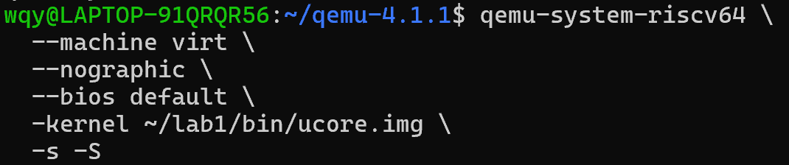
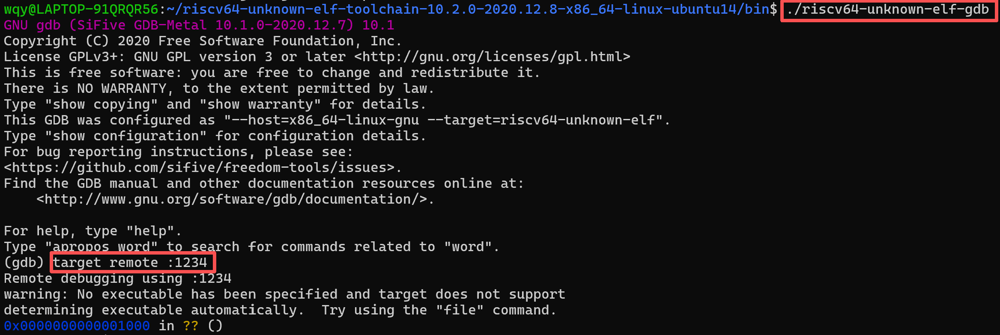
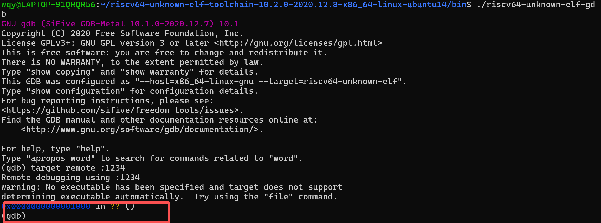
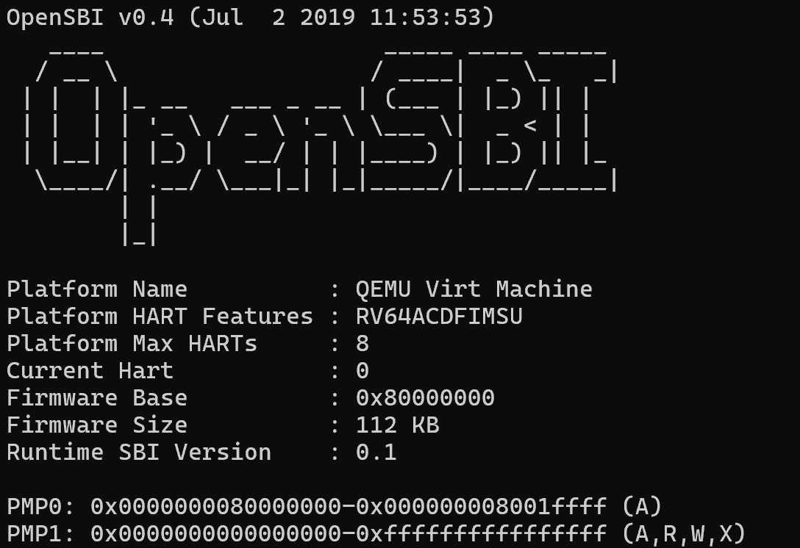
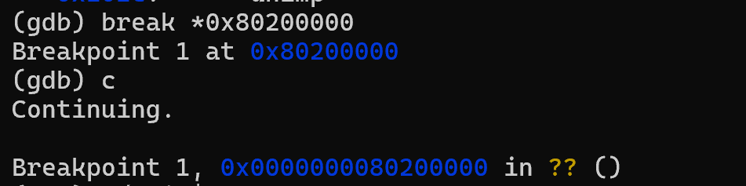

lab1实验报告

小组成员：叶喆妍、吴秋媛、李昱

一、实验目的

本实验旨在通过使用GDB调试QEMU模拟的RISC-V计算机，深入理解从硬件加电到执行内核第一条指令（跳转到0x80200000）的完整启动流程。通过实践掌握QEMU和GDB的调试方法，分析RISC-V架构下的复位向量、固件初始化及控制权移交过程。

二、实验环境

1.模拟器：QEMU（RISC-V virt平台）

2.调试工具：GDB（riscv64-unknown-elf-gdb）

3.目标架构：RISC-V 64位

4.固件：OpenSBI

5.内核：ucore.img（加载地址0x80200000）

三、实验步骤

1. 调试环境配置

（1）在终端1执行'qemu-system-riscv64 \
  --machine virt \
  --nographic \
  --bios default \
  -kernel ~/lab1/bin/ucore.img \
  -s -S'：启动QEMU并暂停于复位向量，等待GDB连接
  

（2）在终端2执行'./riscv64-unknown-elf-gdb'和'target remote :1234'：启动GDB并连接到QEMU的调试端口

2. 跟踪复位向量执行

GDB连接后，程序暂停于RISC-V的复位向量地址'0x1000'：

使用'x/10i $pc'查看初始指令序列：

(gdb) x/10i $pc

=> 0x1000:  auipc   t0, 0x0

   0x1004:  addi    a1, t0, 32
   
   0x1008:  csrr    a0, mhartid
   
   0x100c:  ld      t0, 24(t0)
   
   0x1010:  jr      t0
   
   0x1014:  unimp
   
   0x1016:  unimp
   
   0x1018:  0x8000
   
   0x101a:  unimp
   
   0x101c:  unimp

3. 分析初始指令功能
 
通过单步调试（'si'）和寄存器观察（'info r'），得到各指令功能如下：

0x1000:  auipc  t0, 0x0      将当前PC（0x1000）加载到t0寄存器

0x1004:  addi   a1, t0, 32   计算a1=t0+32=0x1000+32=0x1020

0x1008:  csrr   a0, mhartid  读取机器硬件线程ID（mhartid）到a0寄存器

0x100c:  ld     t0, 24(t0)   从内存地址t0+24（0x1000+24=0x1018）加载数据到t0，得到0x80000000

0x1010:  jr     t0           跳转到t0寄存器存储的地址（0x80000000），执行OpenSBI固件

可以看到此时终端2的QEMU模拟器开始执行OpenSBI固件：

4. 跟踪OpenSBI初始化与内核加载

OpenSBI固件负责硬件初始化并加载内核到'0x80200000'，该地址即为内核地址入口，我们使用断点调试进行跟踪：

执行'(gdb) break *0x80200000'和'(gdb) continue'指令：

查看第一条指令，可以发现是给栈指针设置初始地址，为后续C语言代码执行准备栈空间。

查看内核入口指令：

(gdb) x/10i $pc

=> 0x80200000:    auipc   sp, 0x3        //将栈指针（sp）的初始值设置为0x80203000

   0x80200004:    mv      sp, sp         //栈指针初始值不变
   
   0x80200008:    j       0x8020000a     //跳转至地址0x8020000a
   
   0x8020000a:    auipc   a0, 0x3        //a0寄存器指向入口地址的某一处
   
   0x8020000e:    addi    a0, a0, -2     //a0=a0-2（0x80200008），使其指向明确的地址
   
   0x80200012:    auipc   a2, 0x3        //为a2寄存器加载地址
   
   0x80200016:    addi    a2, a2, -10    //a2=a2-10（0x80203008）
   
   0x8020001a:    addi    sp, sp, -16    //sp=sp-16，在栈上分配16字节的空间，用于存储函数调用的局部变量或保存寄存器
   
   0x8020001c:    li      a1, 0          //a1=0，设置第2个函数参数为0
   
   0x8020001e:    sub     a2, a2, a0     //a2=a2-a0，作为函数调用的第3个参数
   
   
四、实验结果分析

1. 启动流程三阶段验证

（1）硬件复位阶段：从0x1000（初始执行地址）执行初始指令，完成寄存器初始化和OpenSBI跳转

（2）SBI初始化阶段：OpenSBI将内核加载到0x80200000（OpenSBI固件加载地址），为调用初始化函数做准备

（3）内核移交阶段：SBI执行'jr'指令跳转到0x80200000（uCore内核起始地址，即'kern_entry'），内核开始执行

3. 问题回答

(1)阅读 kern/init/entry.S内容代码，结合操作系统内核启动流程，说明指令la sp, bootstacktop 完成了什么操作，目的是什么？ tail kern_init完成了什么操作，目的是什么？

la sp, bootstacktop实现了栈指针的初始化，将bootstacktop的地址加载到栈指针寄存器sp中,目的是设置内核的栈顶地址,为接下来内核执行准备栈空间，由于栈是由高地址向低地址发展，而bootstacktop是栈顶的地址，所以加载该地址，可以为调用C语言做准备。

tail kern_init跳转到kern_init函数执行,并且不需要保存返回地址,目的是实现内核启动，完成初始化页表、设备等操作。

（2）RISC-V硬件加电后最初执行的几条指令位于什么地址？它们主要完成了哪些功能？

RISC-V硬件加电后首先执行的指令位于'0x1000'至'0x1010'地址范围，共5条有效指令。  

'auipc t0, 0x0'和'addi a1, t0, 32'初始化关键寄存器  

'csrr a0, mhartid'获取硬件线程ID  

'ld t0, 24(t0)'从指定内存地址加载固件入口地址  

'jr t0'跳转到OpenSBI固件（0x80000000）执行后续初始化  

五、实验总结

本实验通过GDB调试工具深入分析了RISC-V架构的启动流程，验证了从硬件复位到内核执行的完整过程。关键收获包括：  

1. 掌握QEMU+GDB的RISC-V调试环境搭建方法

2. 理解RISC-V复位向量设计及初始指令功能  

3. 熟悉OpenSBI固件的作用及内核加载机制  

4. 学会使用断点、内存观察等调试技巧
  
实验中验证的知识点:
（1）CPU 加电时，寄存器（如 PC、通用寄存器）和内存均为未初始化状态。为解决 “第一条指令从哪取” 的问题，硬件设计了复位向量（RISC-V 中为0x1000），并通过 ROM（只读存储器）存储最早期启动代码（如 OpenSBI 的初始指令）——ROM 掉电不丢失，确保加电瞬间可读取指令。

（2）OpenSBI 作为硬件与内核的中间层，承担了最底层硬件初始化和内核加载的任务。

（3）执行权的分层移交：启动流程体现了逐步移交控制的设计思想：

硬件→固件（OpenSBI）：通过复位向量跳转到固件；

固件→内核：通过跳转指令移交到内核入口；

汇编→C 语言：内核先通过汇编初始化栈（la sp, bootstacktop），再跳转到 C 函数（tail kern_init），为高级语言执行提供环境。

（4）栈的必要性：C 语言的函数调用、局部变量、返回地址等机制依赖栈。内核启动时，必须先通过汇编指令初始化栈指针（sp），才能执行 C 语言编写的kern_init。

实验未直接覆盖的知识点：

（1）进程管理：实验仅涉及内核启动的最早期阶段，未覆盖 “进程创建、调度、上下文切换” 等。（2）内存管理（虚拟内存）：实验中内核尚未初始化页表，未涉及虚拟内存技术。
