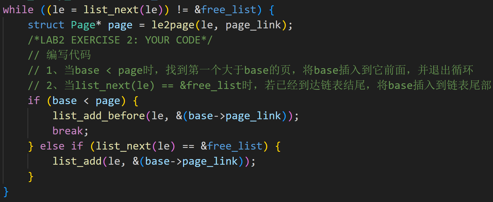
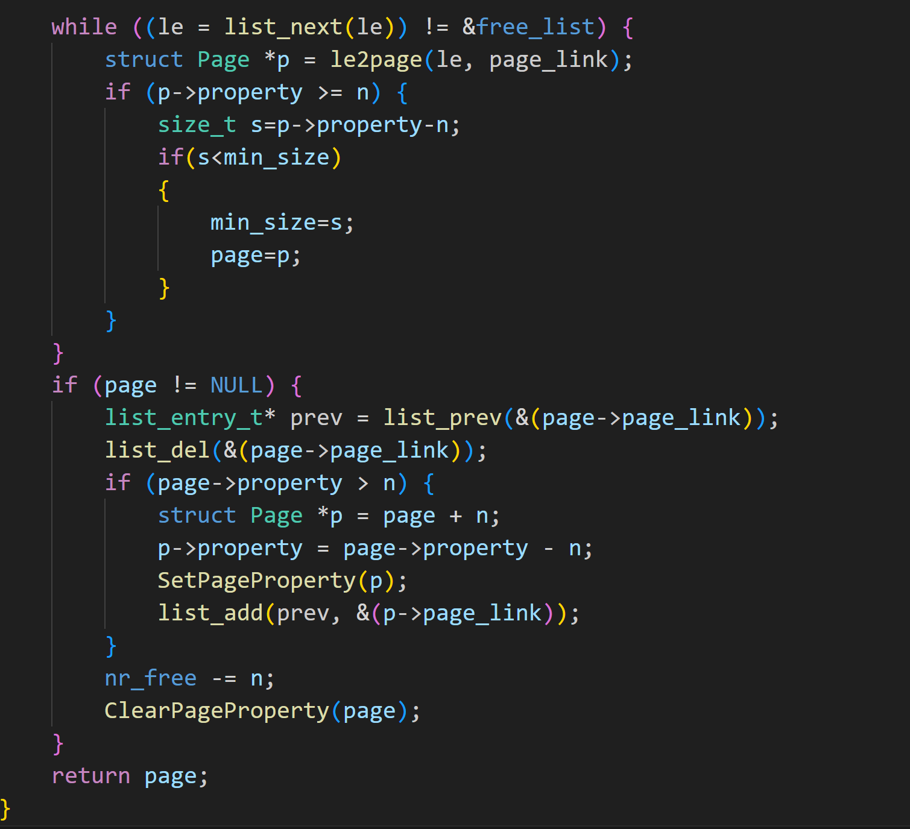
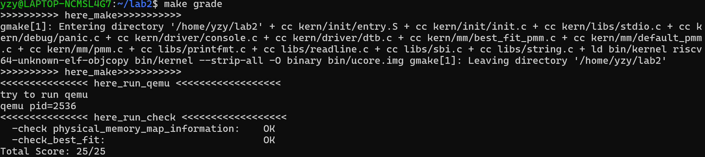

lab2实验报告
小组成员：叶喆妍、吴秋媛、李昱
一、实验目的
本次实验旨在深入理解页表的建立和使用方法，理解物理内存的管理方法，理解页面分配算法，如first_fit算法以及best_fit算法，并对伙伴系统进行扩展学习，尝试构建简化的二层slub算法。
二、实验环境
1. 模拟器：采用QEMU，用于模拟物理硬件环境，支持ucore操作系统的加载与运行，可通过调试端口接收GDB的调试指令。
2. 目标操作系统：ucore内核，核心关注内存管理模块，相关代码集中在`kern/mm/`目录下，包含First-Fit算法的默认实现与内存分配测试用例。
3. 开发与调试工具：使用对应架构的GCC编译器编译内核代码，生成可在QEMU中运行的镜像文件；
4. 核心代码文件：First-Fit算法的实现文件为`kern/mm/default_pmm.c`，Best-Fit算法的自定义实现文件为`kern/mm/best_pmm.c`，内存分配测试用例由`kern/mm/pmm_test.c`提供，用于自动验证算法的正确性。
三、实验步骤
阶段1：First-Fit连续物理内存分配算法分析
First-Fit算法是连续物理内存分配中最基础的方案，其核心逻辑是遍历空闲页链表，找到第一个满足需求的空闲块。
1.核心函数功能解析
`default_init`函数是内存管理模块的初始化入口，主要完成两项工作：一是调用`list_init`函数将空闲页链表`free_list`初始化为空链表，确保后续链表操作的合法性；二是将空闲页数量计数器`nr_free`初始化为0，用于后续统计系统中可用物理页的总数。
`default_init_memmap`函数负责将一段连续的物理页初始化为空闲状态并加入空闲链表。具体流程为：首先遍历从`base`开始的`n`个物理页，为每个页初始化基础属性——将页的引用计数置为0，清除“已分配”标记，确保页处于可分配状态；接着，按照物理地址从小到大的顺序，将当前连续页块插入`free_list`：遍历空闲链表，若当前页块的地址小于某个链表节点的地址，则将页块插入该节点前方，若遍历至链表结尾仍未找到更大地址的节点，则将页块插入链表尾部；最后，设置页块的`property`字段（该字段记录当前连续空闲页的数量），并更新`nr_free`计数器，将初始化的页数量累加到`nr_free`中。
`default_alloc_pages`函数实现First-Fit的核心分配逻辑，输入参数为需要分配的连续页数量`n`。首先判断`n`是否为0或`nr_free`是否小于`n`，若满足任一条件则直接返回NULL，表示分配失败；若分配条件满足，则遍历空闲页链表`free_list`，寻找第一个`property`字段值大于等于`n`的空闲页块；找到目标页块后，若页块的`property`值大于`n`（即分配后仍有剩余空间），则将页块分割为两部分——前`n`个页作为分配给用户的页块，剩余部分作为新的空闲页块重新插入`free_list`；随后，将目标页块从`free_list`中删除，清除页块的“空闲”标记，更新`nr_free`计数器（减去`n`），最终返回目标页块的起始地址。
`default_free_pages`函数用于释放一段连续的物理页并合并内存碎片，输入参数为待释放页块的起始地址与页数量`n`。首先，标记待释放页块为“空闲”状态，更新`nr_free`计数器（加上`n`）；接着，检查待释放页块的前向页与后向页：若前向页为空闲状态（通过“空闲”标记判断），则将前向页块与当前页块合并，更新合并后页块的`property`字段；同理，若后向页为空闲状态，继续合并后向页块；最后，将合并后的完整空闲页块重新插入`free_list`，保持链表的地址有序性，避免碎片分散。
阶段2：Best-Fit连续物理内存分配算法实现与测试
Best-Fit算法的核心目标是“最小化内存碎片”，其逻辑是“遍历所有空闲页块，找到满足需求且剩余空间最小的页块”。基于First-Fit的现有框架，仅需修改分配函数的遍历逻辑，其他初始化与释放逻辑可直接复用。
2.1 代码实现流程
首先，在`kern/mm/`目录下新建`best_pmm.c`文件，复制First-Fit算法中的`default_init`、`default_init_memmap`与`default_free_pages`函数——这三个函数的逻辑与Best-Fit算法无冲突：`default_init`的初始化功能、`default_init_memmap`的页块初始化与有序插入逻辑、`default_free_pages`的碎片合并逻辑，均适用于Best-Fit算法，可以仿照。


核心修改集中在`best_fit_alloc_pages`函数，具体逻辑如下：函数输入为需要分配的页数量`n`，首先判断分配条件（`n`为0或`nr_free < n`时返回NULL）；初始化`page`指针为NULL（用于记录最佳页块地址），`min_size`为无符号长整型的最大值（用于记录最小剩余空间）；遍历空闲页链表`free_list`，对于每个空闲页块，若其`property`值大于等于`n`，则计算该页块分配后的剩余空间（`remain = property - n`）；若`remain`小于当前`min_size`，则更新`min_size`为`remain`，并将`page`指向当前页块；遍历结束后，若`page`不为NULL（找到最佳页块），则记录该页块在链表中的前驱节点，将页块从`free_list`中删除；若页块`property`值大于`n`，则分割页块，将剩余部分作为新的空闲页块插入链表的前驱节点之后；最后，更新`nr_free`计数器（减去`n`），清除目标页块的“空闲”标记，返回`page`指针。
```c
while ((le = list_next(le)) != &free_list) {
        struct Page *p = le2page(le, page_link);
        if (p->property >= n) {
            size_t s=p->property-n;
            if(s<min_size)
            {
                min_size=s;
                page=p;
            }
        }
    }
    if (page != NULL) {
        list_entry_t* prev = list_prev(&(page->page_link));
        list_del(&(page->page_link));
        if (page->property > n) {
            struct Page *p = page + n;
            p->property = page->property - n;
            SetPageProperty(p);
            list_add(prev, &(p->page_link));
        }
        nr_free -= n;
        ClearPageProperty(page);
    }
    return page;
```

2.2 测试与验证
观察模拟器输出的测试结果——ucore内置的`pmm_test`用例会自动执行一系列分配与释放操作，包括分配1页、3页、5页内存，释放已分配页块等，若测试成功，会得到下图结果:

四、实验结果分析
4.1 First-Fit与Best-Fit算法的核心差异
从分配逻辑来看，First-Fit算法在遍历空闲链表时，一旦找到第一个`property ≥ n`的页块就停止遍历，直接进行分配；而Best-Fit算法需要遍历整个空闲链表，对比所有满足条件的页块，选择剩余空间最小的页块进行分配。
在分配速度上，First-Fit无需遍历全链表，找到符合条件的块即可停止，尤其在空闲链表较长时，耗时远低于Best-Fit；Best-Fit因需遍历所有满足条件的块，分配速度较慢，且随着空闲链表长度增加，耗时会线性增长。
在内存碎片控制上，Best-Fit更有优势，由于选择剩余空间最小的块，分配后产生的碎片尺寸较小，且不易形成无法利用的小碎片；而First-Fit容易将大的空闲块提前分割，产生较多分散的小碎片，长期频繁分配与释放后，可能出现有足够总空闲页但无连续空闲页的分配失败情况。
4.2 算法的改进空间
first-fit的改进空间：由于这个first-fit是找到第一个符合条件的块就停止，所以执行速度很快，但是由于first-fit会分割空间，所以会产生许多小碎片，为尽量减少这种问题，可以主动合并分割剩下的碎片，或是在最开始就分配好大中小三种类型的空间，按需要大小在这几个空间里面进行搜索，这样可以减少无效的搜索。
best-fit改进空间：该方法的碎片小，但是由于需要遍历整个链表，速度较慢，我们可以将空闲块从小到大进行排列，这样不需要遍历整个链表，可以减少访问次数。
五、实验中用到的知识点与重要但未用到的知识点
5.1 实验中用到的知识点
1. 连续物理内存分配原理：实验核心围绕“空闲页链表管理”展开，理解了连续分配的核心依赖——通过`free_list`维护空闲块的地址有序性，通过`property`字段记录块大小，所有分配/释放操作均基于链表的增删与块的分割/合并，这是连续内存分配的底层逻辑。
2. 链表数据结构的实际应用：在First-Fit与Best-Fit算法中，`free_list`采用双向链表实现，通过`list_init`、`list_next`、`list_prev`、`list_add`、`list_del`等函数完成链表的初始化、遍历、插入与删除操作，掌握了链表在“动态管理内存块”场景下的使用方法。
3. 物理页属性管理：实验中涉及物理页的“空闲/已分配”标记（通过`SetPageProperty`与`ClearPageProperty`函数设置）、引用计数（初始化时置0）等属性，理解了OS如何通过页属性标记区分内存状态，确保分配与释放的正确性。
4. 算法的实现与优化思路：通过对比First-Fit与Best-Fit的逻辑差异，理解了算法设计中“速度”与“碎片”的权衡关系，学会基于现有框架修改算法核心逻辑，同时思考改进方向，提升了算法设计与优化能力。
5.2 重要但未用到的知识点
1. 虚拟内存技术：实验中分配的是物理内存地址，未涉及虚拟内存——实际OS中，用户进程使用的是虚拟地址，需通过页表映射到物理地址，虚拟内存可解决“连续物理内存不足”的问题（通过离散物理页映射实现连续虚拟地址），是现代OS内存管理的核心技术，实验未覆盖该部分。
2. 内存回收机制：实验仅涉及内存分配与释放，未涉及内存回收——实际OS中，当内存不足时，会通过页面置换（如LRU算法）将暂时不用的物理页换出到磁盘，释放物理内存，内存回收是OS保证内存充足的重要机制，实验未覆盖。
六、实验总结
本次实验通过分析First-Fit算法、实现Best-Fit算法，并且尝试了伙伴系统、slub等高级内存分配算法，深入理解了连续物理内存分配的核心原理与实际应用。实验过程中，不仅掌握了内存管理模块的关键函数逻辑、链表操作的实际应用，还通过调试验证了算法正确性，对比了两种算法的优劣。
通过实验发现，连续物理内存分配的核心优势是实现简单、无需复杂映射，但局限性也很明显——易产生内存碎片、无法利用不连续空闲页。

扩展练习Challenge：硬件的可用物理内存范围的获取方法（思考题）
如果 OS 无法提前知道当前硬件的可用物理内存范围，请问你有何办法让 OS 获取可用物理内存范围？
答：可以尝试不断探索边界地址来获取，比如先写入某个地址，然后立刻读回，如果返回正常值，则下次继续试探更大的地址范围，直到出现错误，这样可以大概估计。
但是上述方法有较大的隐患，经过网上的搜索，我们发现实际应用中，可以采用这样的方法：
如果操作系统无法提前知道硬件的可用物理内存范围，可以通过在系统启动的早期阶段借助固件或硬件接口来动态获取。
通过 BIOS 提供的内存探测接口来获得物理内存分布信息。可以使用BIOS内存映射接口，让内核在启动时调用中断服务，获取一张包含所有可用和保留内存段的内存映射表（memory map），就可以知道哪些区域是可用的物理内存。
如果在ARM平台的话也可以利用设备树来判断哪些地址空间可用。这样，OS 就能在启动时动态确定可用的物理内存范围，而不用事先硬编码。