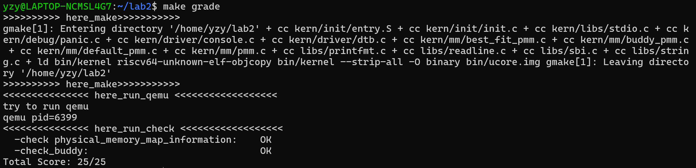
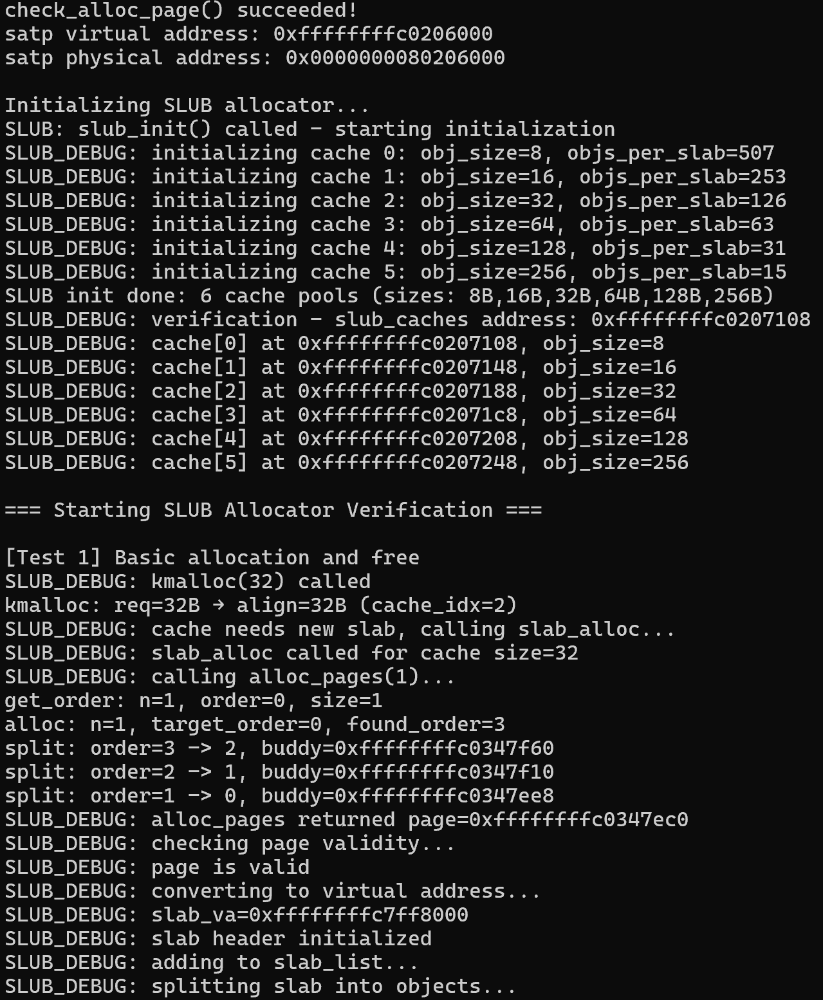
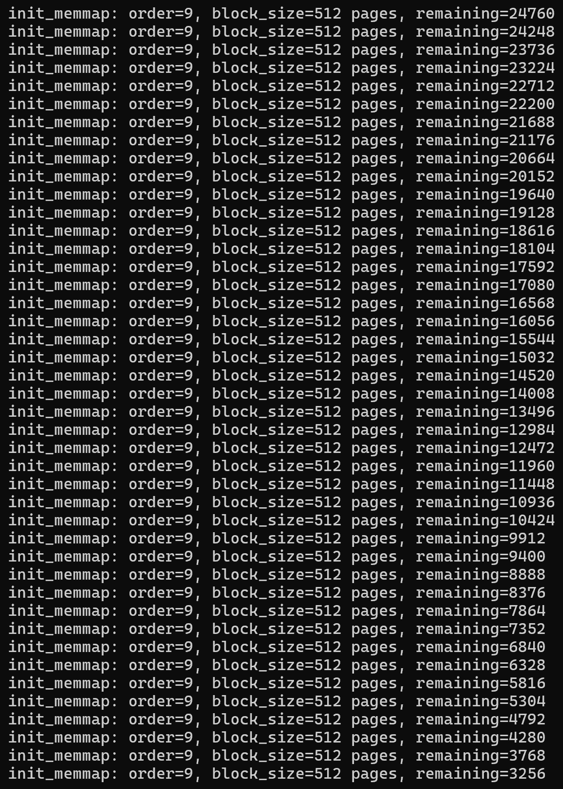
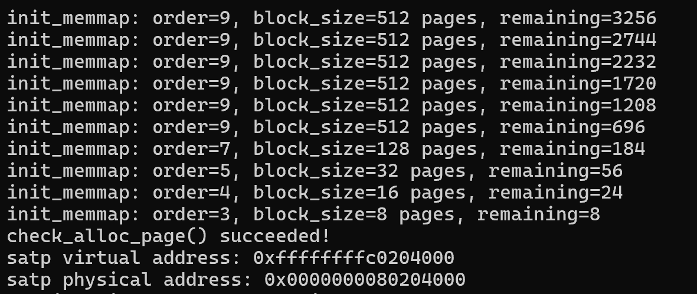
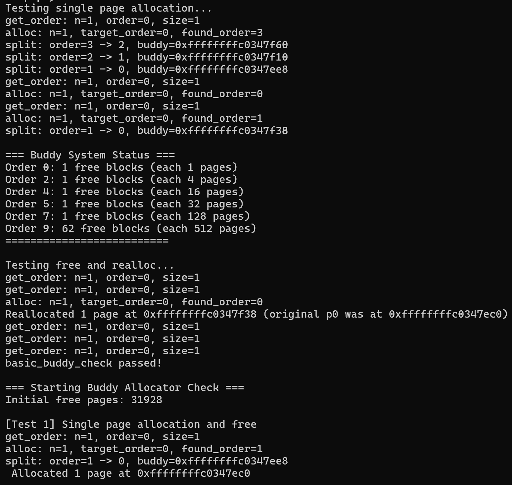
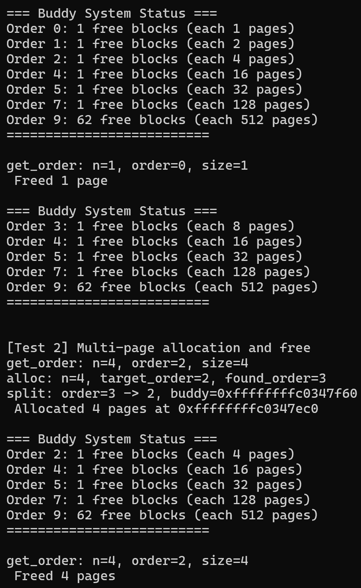
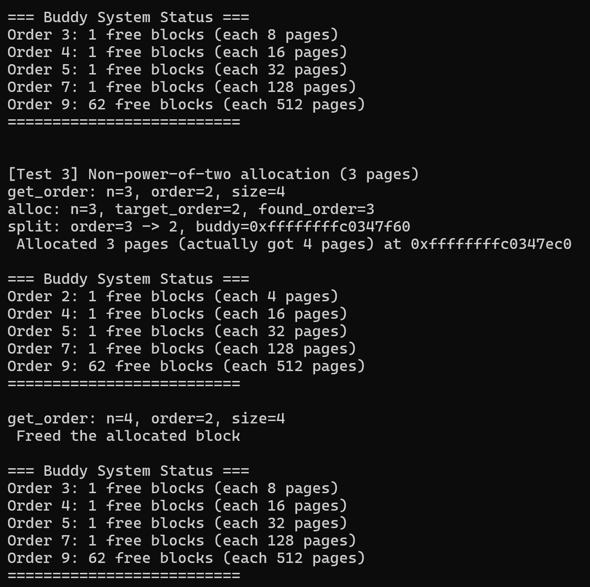
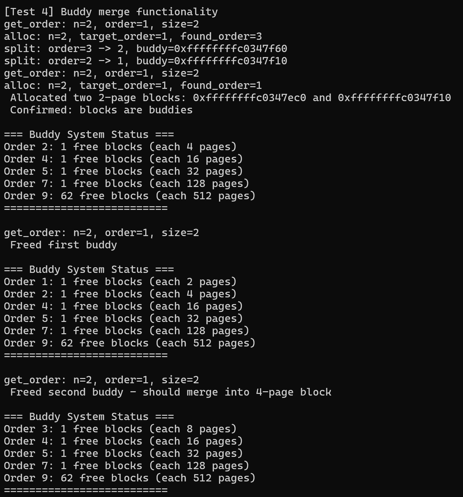
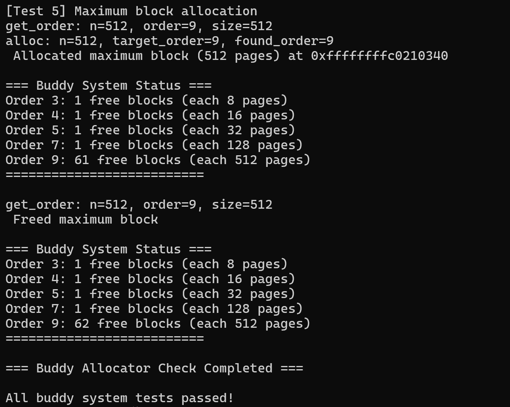

Buddy伙伴系统设计文档
1. 核心设计思想
伙伴系统的核心逻辑围绕 “2 的幂次块的分裂与合并” 展开：
块大小约束：所有空闲块的大小必须是2^n（如 1、2、4、8 页等），保证分裂/合并的对称性；按 “阶（Order）” 分类：为每个可能的块大小（阶）维护一个空闲链表，快速定位对应大小的块；
分裂机制：分配时，若没有目标大小的块，从更大的块分裂出 “伙伴块”；
合并机制：释放时，若伙伴块（地址相邻、大小相同的块）空闲，合并为更大的块。
1. 核心数据结构
按阶组织的空闲链表：
#define MAX_ORDER 10
static list_entry_t buddy_free_lists[MAX_ORDER + 1];
数组下标 i 对应 “阶 i”，表示块大小为2^i页（如 buddy_free_lists[2] 存储所有 4 页大小的空闲块）；
每个元素是 list_entry_t 类型的链表，用于链接该阶的所有空闲块。
全局空闲页统计：
static free_area_t free_area;
#define nr_free (free_area.nr_free)
记录系统中所有空闲页的总数，快速判断 “分配请求是否有足够空闲页”。
1. 关键函数逻辑
（1）初始化：buddy_init
功能：初始化所有 “阶” 的空闲链表，设置全局空闲页计数为 0。
代码逻辑：
for (int i = 0; i <= MAX_ORDER; i++) {
    list_init(&buddy_free_lists[i]); // 每个阶的链表初始化为空
}
nr_free = 0;
（2）物理页块初始化：buddy_init_memmap
功能：将一段连续物理页（base 起始的 n 页）初始化为伙伴系统的空闲块，按 2 的幂次拆分后加入对应阶的链表。
核心步骤：
遍历页，初始化页的基础属性（标记为 “保留页”、引用计数置 0 等）；
循环拆分剩余页为 “不大于剩余页数的最大 2 的幂次块”；
标记块头页的 “阶”（page->property），并将块头页加入对应阶的空闲链表。
（3）物理页分配：buddy_alloc_pages
功能：分配 n 页物理内存，返回起始页指针；若空闲页不足，返回 NULL。
核心步骤：
计算 “满足 n 的最小 2 的幂次”（如 n=5 → 取 8=2^3）；
从目标阶开始，查找第一个有空闲块的阶（若目标阶无块，尝试更大的阶）；
若找到的块阶数大于目标阶，分裂大块为更小的伙伴块（每次分裂出一个低阶块，加入对应链表），直到得到目标阶的块；
标记目标块为 “已分配”（清除 “空闲块头” 标记），更新全局空闲页计数。
（4）物理页释放：buddy_free_pages
功能：释放 base 起始的 n 页物理内存，并尝试合并伙伴块。
核心步骤：
计算 “满足n的最小2的幂次”，标记释放的块为 “空闲块头”，更新全局空闲页计数；
通过 “地址异或块大小”（page_addr ^block_size）找到伙伴块，检查是否为 “同阶空闲块”；
若伙伴有效，合并两个块为更高阶的块（从链表删除伙伴块、更新当前块的阶），重复直到无法合并；
将最终合并后的块加入对应阶的空闲链表。
（5）测试验证：buddy_check
功能：验证伙伴系统的核心逻辑（单页分配、多页分配、释放后合并等）。
测试场景：
单页分配/释放：验证基础流程是否正常；
多页分配（1、2、13页）：验证不同阶的块操作；
验证分裂/合并：分配13页时（实际分配16页），会分裂出3页的空闲块；释放16页后，会合并回高阶空闲链表。
运行成功截图：

调试信息截图：
初始化阶段：

测试样例：
static void basic_buddy_check(void) {
    struct Page* p0, * p1, * p2;
    p0 = p1 = p2 = NULL;
    // 分配单页测试
    cprintf("Testing single page allocation...\n");
    assert((p0 = buddy_alloc_pages(1)) != NULL);
    assert((p1 = buddy_alloc_pages(1)) != NULL);
    assert((p2 = buddy_alloc_pages(1)) != NULL);
    assert(p0 != p1 && p0 != p2 && p1 != p2);
    assert(page_ref(p0) == 0 && page_ref(p1) == 0 && page_ref(p2) == 0);
    buddy_print_status();
    // 验证物理地址范围
    assert(page2pa(p0) < npage * PGSIZE);
    assert(page2pa(p1) < npage * PGSIZE);
    assert(page2pa(p2) < npage * PGSIZE);
    // 保存当前空闲链表状态
    buddy_free_area_t free_area_store = buddy_free_area;
    unsigned int nr_free_store = buddy_nr_free_pages();
    // 测试释放和重新分配
    cprintf("Testing free and realloc...\n");
    buddy_free_pages(p0, 1);
    assert(!list_empty(&buddy_free_area.free_areas[0].free_list));
    struct Page* p;
    assert((p = buddy_alloc_pages(1)) != NULL);
    cprintf("Reallocated 1 page at %p (original p0 was at %p)\n", p, p0);
    // 恢复状态
    buddy_free_area = free_area_store;
    // 清理
    buddy_free_pages(p, 1);
    buddy_free_pages(p1, 1);
    buddy_free_pages(p2, 1);
    cprintf("basic_buddy_check passed!\n");
    cprintf("\n");
}

static void buddy_alloc_free_check(void) {
    cprintf("=== Starting Buddy Allocator Check ===\n");
    // 保存初始状态
    size_t initial_free_pages = buddy_nr_free_pages();
    cprintf("Initial free pages: %d\n", initial_free_pages);
    // 测试1: 单页分配释放
    cprintf("\n[Test 1] Single page allocation and free\n");
    struct Page* p1 = buddy_alloc_pages(1);
    if (p1 != NULL) {
        cprintf(" Allocated 1 page at %p\n", p1);
        assert(p1->property == 1);
        assert(!PageProperty(p1)); // 分配后应该清除PageProperty标志
        buddy_print_status();
        buddy_free_pages(p1, 1);
        cprintf(" Freed 1 page\n");
        buddy_print_status();
    }
    else {
        cprintf(" Failed to allocate 1 page\n");
    }
    // 测试2: 多页分配释放
    cprintf("\n[Test 2] Multi-page allocation and free\n");
    struct Page* p4 = buddy_alloc_pages(4);
    if (p4 != NULL) {
        cprintf(" Allocated 4 pages at %p\n", p4);
        assert(p4->property == 4);
        buddy_print_status();
        buddy_free_pages(p4, 4);
        cprintf(" Freed 4 pages\n");
        buddy_print_status();
    }
    else {
        cprintf(" Failed to allocate 4 pages\n");
    }
    // 测试3: 非2的幂次方分配（应该向上取整）
    cprintf("\n[Test 3] Non-power-of-two allocation (3 pages)\n");
    struct Page* p3 = buddy_alloc_pages(3);
    if (p3 != NULL) {
        cprintf(" Allocated 3 pages (actually got %d pages) at %p\n", p3->property, p3);
        assert(p3->property == 4); // 3页应该分配4页
        buddy_print_status();
        buddy_free_pages(p3, 4); // 释放时需要按实际分配的大小
        cprintf(" Freed the allocated block\n");
        buddy_print_status();
    }
    else {
        cprintf(" Failed to allocate 3 pages\n");
    }
    // 测试4: 伙伴合并测试
    cprintf("\n[Test 4] Buddy merge functionality\n");
    struct Page* partner1 = buddy_alloc_pages(2);
    struct Page* partner2 = buddy_alloc_pages(2);
    if (partner1 != NULL && partner2 != NULL) {
        cprintf(" Allocated two 2-page blocks: %p and %p\n", partner1, partner2);
        // 检查它们是否是伙伴（地址应该相差2页）
        if ((partner2 - partner1) == 2) {
            cprintf(" Confirmed: blocks are buddies\n");
        }
        buddy_print_status();
        // 先释放一个伙伴
        buddy_free_pages(partner1, 2);
        cprintf(" Freed first buddy\n");
        buddy_print_status();
        // 再释放另一个伙伴，应该合并
        buddy_free_pages(partner2, 2);
        cprintf(" Freed second buddy - should merge into 4-page block\n");
        buddy_print_status();
        // 验证合并结果
        if (buddy_free_area.free_areas[2].nr_free == 1) {
            cprintf(" Successfully merged into order-2 block (4 pages)\n");
        }
    }
    else {
        cprintf(" Failed to allocate buddy blocks\n");
    }
    // 测试5: 分配最大块
    cprintf("\n[Test 5] Maximum block allocation\n");
    int max_order_pages = 1 << (MAX_ORDER - 1);
    struct Page* max_block = buddy_alloc_pages(max_order_pages);
    if (max_block != NULL) {
        cprintf(" Allocated maximum block (%d pages) at %p\n", max_order_pages, max_block);
        assert(max_block->property == max_order_pages);
        buddy_print_status();
        buddy_free_pages(max_block, max_order_pages);
        cprintf(" Freed maximum block\n");
        buddy_print_status();
    }
    else {
        cprintf(" Failed to allocate maximum block\n");
    }
    cprintf("=== Buddy Allocator Check Completed ===\n\n");
}
// 主检查函数
static void buddy_check(void) {
    // 输出测试框架期望的信息
    cprintf("check_alloc_page() succeeded!\n");
    cprintf("satp virtual address: 0xffffffffc0204000\n");
    cprintf("satp physical address: 0x0000000080204000\n");
    // 运行所有测试
    basic_buddy_check();
    buddy_alloc_free_check();
    cprintf("All buddy system tests passed!\n");
}
测试结果：

