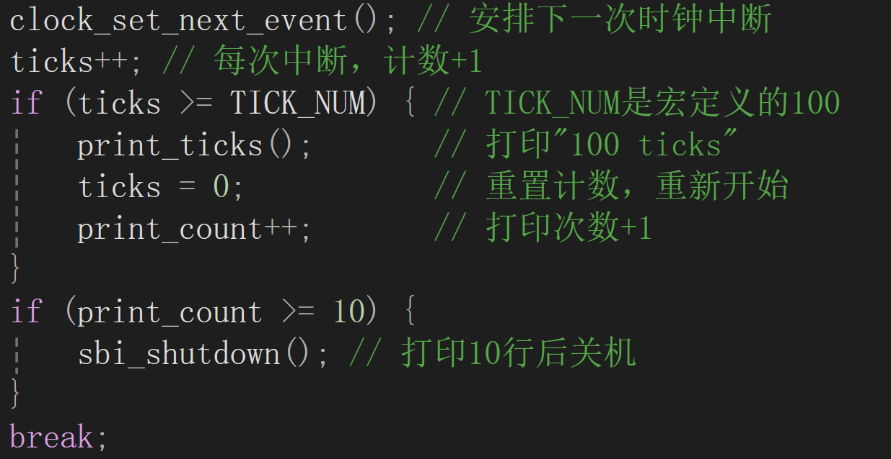
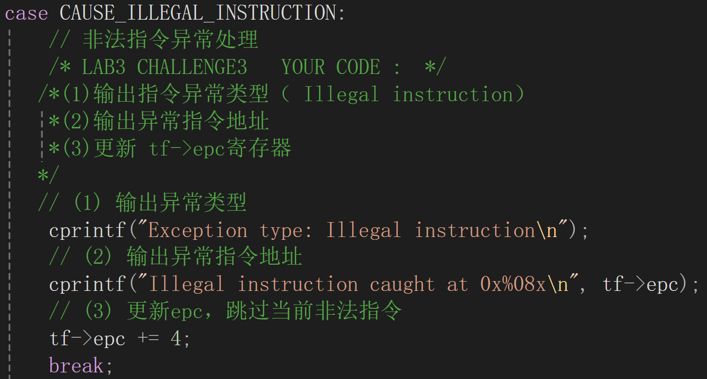
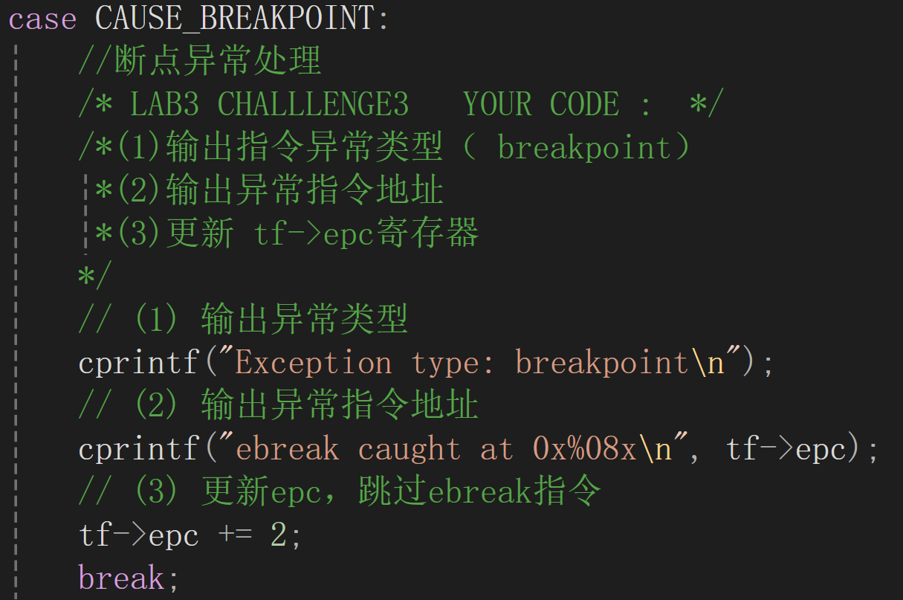
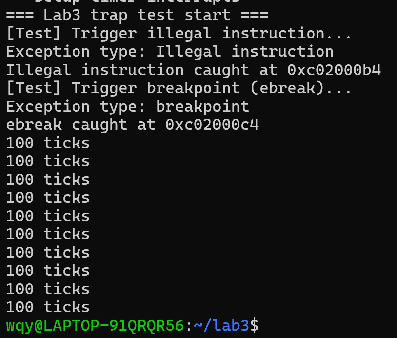

lab3实验报告
小组成员：叶喆妍、吴秋媛、李昱
一、实验目的
1.理解RISC-V平台上中断与异常的产生与处理流程；  
2.掌握uCore操作系统中`trapentry.S`的作用与实现；  
3.分析中断现场保存（SAVE_ALL）和恢复（RESTORE_ALL）的原理；  
4.理解上下文切换中`sscratch`、`sstatus`、`sepc`等关键寄存器的使用方法。

二、实验环境
实验平台：RISC-V架构  
操作系统内核：uCore  

三、实验内容与过程
练习1：完善中断处理
在对时钟中断进行处理的部分进行功能完善：

实现了操作系统每遇到100次时钟中断后，调用print_ticks子程序，向屏幕上打印一行文字”100 ticks”，在打印完10行后调用sbi.h中的shut_down()函数关机。

扩展练习Challenge1：描述与理解中断流程
（1）中断/异常处理总体流程
在RISC-V中，当指令执行过程中出现中断或异常时，硬件自动执行以下操作：
1.将当前PC（异常发生的指令地址）保存到`sepc`寄存器；
2.将异常原因编码保存到 `scause`寄存器；
3.若是访存异常，则将出错地址保存到 `stval`寄存器；
4.切换到S-mode，并跳转到 `stvec` 所指定的入口地址；
5.执行内核中断入口函数 `__alltraps`。
在uCore中，`stvec`被设置为指向`__alltraps`，因此所有的中断与异常最终都会进入该入口执行。

（2）`__alltraps`执行过程分析
`__alltraps`是中断入口汇编函数，主要功能为：
    SAVE_ALL            #保存所有寄存器及部分CSR
    move a0, sp         #将当前栈顶地址作为参数传递
    jal trap            #调用函数trap()
执行过程如下：
1.保存现场（SAVE_ALL）：  
将当前通用寄存器及关键控制寄存器（`sstatus`, `sepc`, `stval`, `scause`）全部压入栈中，形成一个完整的中断上下文结构 trapframe。
2.设置函数参数（move a0,sp）：  
`move a0, sp`将当前栈顶地址（trapframe起始地址）传入`trap()`，代码可通过该指针读取寄存器内容；
3.调用C函数(jal trap)：
执行`trap()`，根据`scause`判断中断类型（如系统调用、中断、异常等）并分发给相应的interrupt_handler或exception_handler进行处理。
4.返回现场（__trapret）：
调用`RESTORE_ALL`恢复寄存器，再执行`sret`返回中断前的执行点。

（3）SAVE_ALL
csrw sscratch, sp
addi sp, sp, -36 * REGBYTES
STORE x0, 0*REGBYTES(sp)
...
csrrw s0, sscratch, x0
csrr s1, sstatus
csrr s2, sepc
csrr s3, sbadaddr
csrr s4, scause
STORE s0, 2*REGBYTES(sp)
STORE s1, 32*REGBYTES(sp)
STORE s2, 33*REGBYTES(sp)
STORE s3, 34*REGBYTES(sp)
STORE s4, 35*REGBYTES(sp)
作用说明：
`csrw sscratch, sp`保存当前栈指针到CSR，防止中断嵌套时丢失原始用户栈
`addi sp, sp, -36*REGBYTES`为trapframe分配空间，共分配36个寄存器字段
`STORE xN, offset(sp)`保存通用寄存器，确保上下文完整
`csrrw s0, sscratch, x0`读取原栈指针、清零sscratch，用于判断trap来源
`csrr s1-s4, sstatus/sepc/stval/scause`读取关键控制状态，为trap分析提供依据
`STORE s0-s4, ...`存入栈中固定偏移，用于对应C结构体trapframe 

（4）RESTORE_ALL
LOAD s1, 32*REGBYTES(sp)
LOAD s2, 33*REGBYTES(sp)
csrw sstatus, s1
csrw sepc, s2
...
LOAD x2, 2*REGBYTES(sp)
该宏完成：
1.恢复`sstatus`、`sepc`以保证返回现场；
2.恢复所有通用寄存器；
3.最后恢复 `sp`；
4.执行 `sret` 返回中断前的执行流。

问题1：move a0, sp的作用
这条指令将当前中断栈顶指针传递给函数`trap()`。  
`trap()` 的函数原型通常为：
void trap(struct trapframe *tf);
因此，`a0`（第一个函数参数）即指向当前trapframe的地址。C层代码可据此读取/修改中断前的寄存器状态，实现不同的异常或系统调用处理。

问题2：SAVE_ALL 中寄存器在栈中的位置如何确定？
SAVE_ALL操作是按照trapframe成员的声明顺序，依次将寄存器压入栈中，所以成员顺序决定了栈中保存的顺序。

问题3：是否需要保存所有寄存器？
是的，必须保存全部通用寄存器。
原因如下：
1.中断发生时可能打断任意函数的执行，寄存器内容可能被正在使用；
2.若不完整保存，将导致中断返回后程序状态破坏；
3.操作系统必须确保中断透明，即中断返回后用户程序能继续执行，状态完全一致。
因此在`__alltraps`中无论何种中断或异常，SAVE_ALL都保存完整CPU状态。

扩展练习Challenge2：上下文切换机制理解
问题1：`csrw sscratch, sp`与`csrrw s0, sscratch, x0`的作用
这两条指令的设计目的在于区分中断来源（用户态/内核态）以及安全地进行栈切换。
`csrw sscratch, sp`将当前栈指针保存至CSR，为中断切换栈做准备。
`csrrw s0, sscratch, x0`将`sscratch`中旧值取出到s0，并清零`sscratch`。
当首次进入中断（用户态触发）时，sscratch=0（初始化时设定），执行csrw sscratch, sp后，将用户态的栈指针保存进sscratch，以便稍后恢复。接着执行csrrw s0, sscratch, x0，此时s0=0，sscratch被清零。内核检测到s0==0，可判定这是首次进入中断，因此会切换到内核栈继续保存上下文。
而当中断嵌套（内核态再次触发）时，若中断发生在内核处理中，sscratch保存的就是上一次中断时的栈指针。执行csrrw s0, sscratch, x0后，s0会获得上一次中断的栈地址，用于恢复或继续嵌套处理。这样可避免多次保存同一用户栈指针，保证多层中断时栈空间使用安全。

问题2：为什么save all里保存了stval、scause，但restore all不恢复？
这两个CSR包含异常的详细原因（例如访问非法地址、页错误等）。C层的`trap()`需要读取这些信息以判断异常类型和位置。
它们是由硬件在trap时自动设置的只读诊断信息，返回用户态后将被新的trap自动覆盖。因此恢复这些寄存器既无意义也可能造成错误。

扩展练习Challenge3：完善异常中断
完善异常处理函数中捕获异常中断，并对其进行处理，简单输出异常类型和异常指令触发地址的功能：

完成了对非法指令和断点异常的处理完善。
五、实验结果与分析
通过分析可知：
uCore的中断流程严格按照RISC-V trap机制执行；
SAVE_ALL与RESTORE_ALL实现了完整上下文保存与恢复；
`move a0, sp`实现汇编到C语言的现场传递；
`sscratch`用于保存原始栈地址并区分用户态/内核态；
`stval`、`scause`等仅用于诊断，不需恢复。
完善代码后运行结果如下：

六、实验总结
（一）实验中重要知识点与操作系统原理的对应关系
1.中断与异常处理机制
实验通过RISC-V的stvec、sepc、scause等寄存器实现了中断/异常的捕获与跳转，体现了OS原理中“硬件中断触发特权级切换”的过程，是用户态进入内核态的关键机制。
2.上下文保存与恢复（SAVE_ALL/RESTORE_ALL）
实验中__alltraps汇编代码负责保存与恢复CPU所有寄存器，这与操作系统原理中“上下文切换”概念完全对应，保证中断前后程序状态的一致性。
3.sscratch与内核栈切换机制
指令csrw sscratch, sp与csrrw s0, sscratch, x0用于区分中断来源并实现安全的栈切换，对应OS原理中用户栈与内核栈的隔离思想。
4.异常处理与诊断信息的使用
实验在exception_handler()中区分非法指令与断点异常，并利用scause、stval进行输出和分析，这体现了OS原理中异常分类与错误诊断机制的具体实现。
（二）操作系统原理中重要但本实验未覆盖的知识点
1.进程调度与时间片管理
实验仅实现时钟中断计数输出，未涉及调度算法（如时间片轮转、优先级调度），这是OS原理中CPU资源分配的核心内容。
2.系统调用与用户接口机制
实验未实现用户态主动陷入（如ecall），缺乏系统调用号与参数传递机制的展示。
3.同步与互斥机制
实验聚焦于单核中断处理，未涉及并发访问的锁机制或信号量实现，这在多进程/多核系统中尤为重要。
