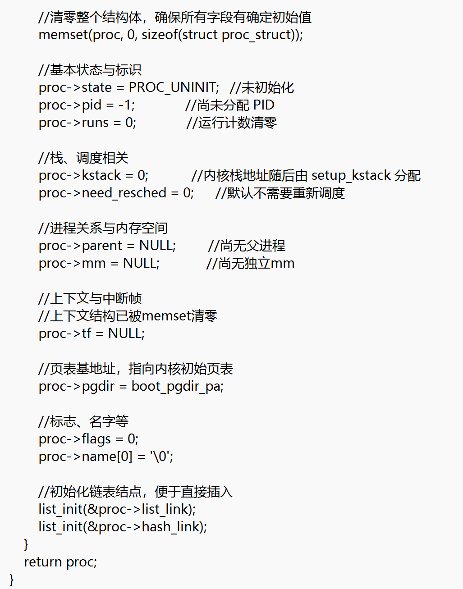
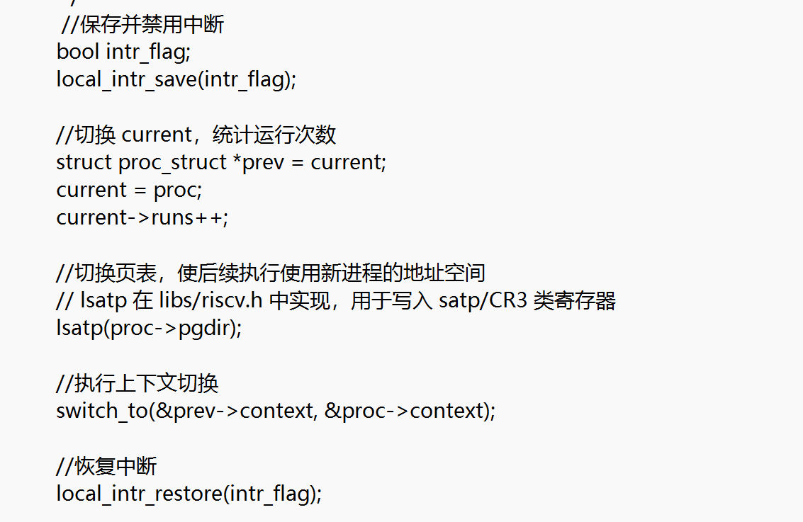
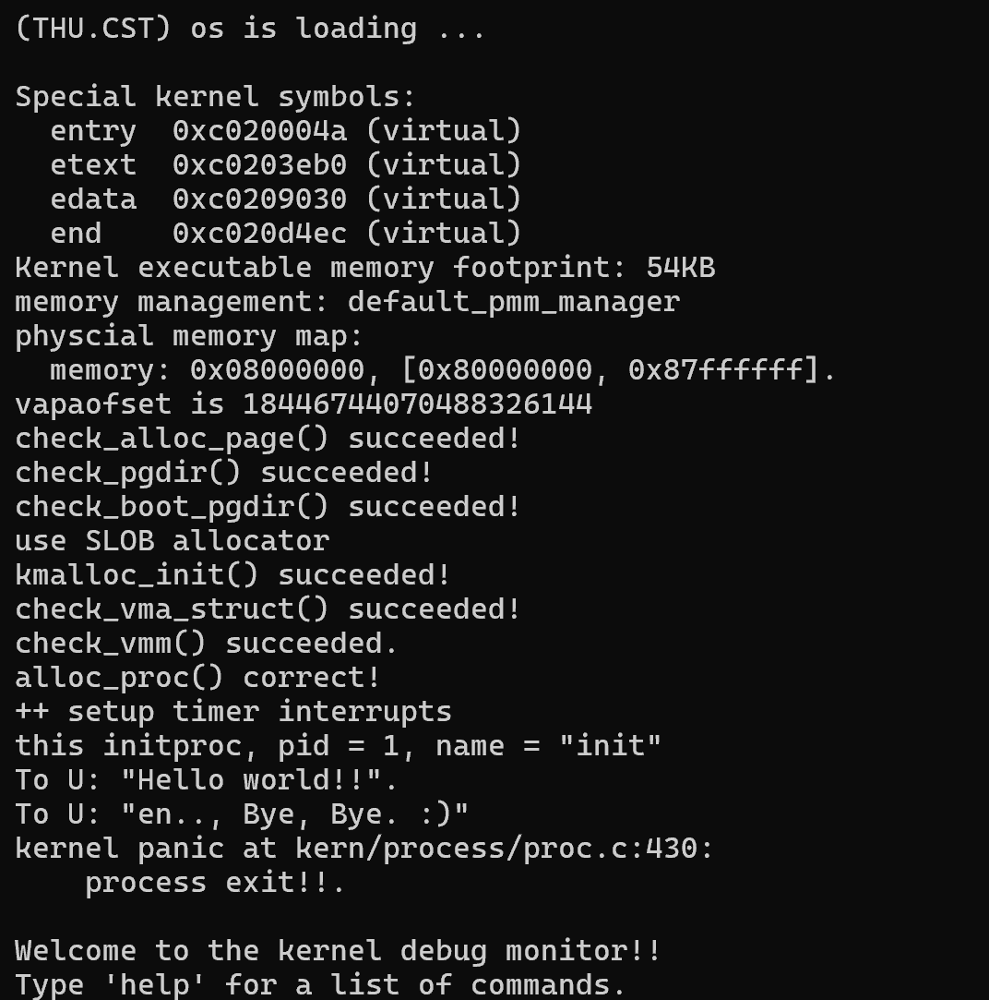

Lab4实验报告
小组成员：叶喆妍、吴秋媛、李昱
一、实验目的
1.理解并实现`proc_struct`的初始化、内核线程创建流程、进程上下文切换等核心机制。
2.熟悉OS中进程控制块（PCB）、内核栈、`trapframe`、`context`、调度等概念的作用。
3.理解uCore线程机制的简单实现，并与理论中的进程/线程概念对应起来。

二、实验环境
实验平台：RISC-V架构  
操作系统内核：uCore

三、实验内容与过程
练习1：分配并初始化一个进程控制块
实现步骤如下：
1.调用`kmalloc`分配`proc_struct`大小的内存。
2.使用`memset`清零结构体，确保所有字段清零。
3.为主要字段设置合理初始值。

问题回答：
（1）context的含义与作用
`struct context`是进程上下文，保存的是CPU寄存器状态，主要用于内核级的上下文切换。
当CPU在执行某个内核线程时，如果要切换到另一个内核线程，就会调用`switch_to`。
`context`保存了上一个内核线程的栈指针和寄存器状态，让它下次恢复运行时从正确位置继续。实现内核线程间的调度和上下文切换，保证多任务轮转。
（2）trapframe的含义与作用
`trapframe`是中断/异常/系统调用发生时保存的CPU状态，里面保存的是用户态寄存器和一些特殊寄存器。
保存用户态的CPU状态，用于系统调用时记录用户态寄存器、异常/缺页处理时保存现场、从内核返回用户态时恢复寄存器和PC。

练习2：为新创建的内核线程分配资源
实现步骤如下：
1.调用alloc_proc：分配PCB结构体
2.调用set_kstack分配内核栈
3.调用copy_mm复制内存管理结构
4.调用copy_thread复制执行上下文
5.将新线程插入系统进程管理结构
6.唤醒线程,设置为PROC_RUNNABLE
7.返回子线程PID

问题回答：
ucore是否保证pid唯一？
是的，ucore为每个新fork的线程分配了唯一的pid。
理由如下：
首先get_pid()为每次fork生成自增PID，同时严格检查已存在进程，避免重复。PID在全局范围内唯一，内核线程与用户线程共用同一PID分配机制，无冲突

练习3：编写proc_run函数
实现步骤如下：
1.判断是否需要切换进程
2.禁用中断
3.切换当前进程
4.切换地址空间：写SATP以启用新进程的页表
5.调用switch_to()执行上下文切换
6.恢复中断

回答问题：
实验共创建几个内核线程？
实验共创建了2 个内核线程：idleproc与initproc。
idleproc负责运行cpu_idle()，扮演调度器入口的角色，当CPU无事可做时，idleproc运行，发现需要调度后切换到其他线程，分配CPU资源。
initproc负责初始化，模拟系统中的init线程，运行结束后触发do_exit()，导致panic。

扩展练习Challenge：
1.说明语句local_intr_save(intr_flag);....local_intr_restore(intr_flag);是如何实现开关中断的？
（1）保存当前中断状态：
读取RISC-V sstatus寄存器中的SSTATUS_SIE位。
若中断允许，则返回true并关闭中断。
（2）关闭中断：
调用intr_disable()清除SIE位，使CPU不响应中断。
（3）恢复中断：
根据保存的状态flag决定是否调用intr_enable()重新允许中断。

2.深入理解不同分页模式的工作原理（思考题）
get_pte()函数（位于kern/mm/pmm.c）用于在页表中查找或创建页表项，从而实现对指定线性地址对应的物理页的访问和映射操作。这在操作系统中的分页机制下，是实现虚拟内存与物理内存之间映射关系非常重要的内容。
（1）get_pte()函数中有两段形式类似的代码， 结合sv32，sv39，sv48的异同，解释这两段代码为什么如此相像。
首先多级页表的层级结构统一：
Sv32的页表级数为2，虚拟地址分解为PDX1；
Sv39的页表级数为3，虚拟地址分解为PDX2；
Sv48的页表级数为4，虚拟地址分解为PDX3；
由于每一级页表都需要判断是否存在，若不存在且create==true，就分配一页作为页表，最终返回指向实际页的页表项（PTE），分页的逻辑一致。
两段代码分别处理倒数两级页表，对应不同分页模式时，逻辑基本一致，所以代码高度相似。
（2）目前get_pte()函数将页表项的查找和页表项的分配合并在一个函数里，你认为这种写法好吗？有没有必要把两个功能拆开？
当前写法下，get_pte()同时实现查找页表项和根据需要分配页表页，其优点为调用方便，一步得到可用PTE，减少重复代码。但功能耦合，不利于理解和单元测试，无法区分只查询PTE或需要分配页的场景。
所以可以将两个功能拆分，拆分建议如下：
pte_t *lookup_pte(pde_t *pgdir, uintptr_t la);  //仅查询
pte_t *alloc_pte(pde_t *pgdir, uintptr_t la);   //必要时分配
将查询与分配分开使得逻辑更清晰，维护性更好。
四、运行结果
运行结果如下：

结果表明：`initproc`成功创建并执行，输出指定信息后进程退出，流程符合预期，说明进程管理与切换的实现正确。
五、重要知识点
实验涉及：
1. 进程控制块初始化：`alloc_proc`分配并初始化`proc_struct`，包含进程状态、PID、内核栈、上下文等核心字段。
2. 进程创建（`do_fork`）：完成 PCB 分配、内核栈分配、上下文复制、进程列表加入、进程唤醒等完整流程。
3. 进程切换（`proc_run`）：通过中断控制、页表切换（`SATP` 寄存器）、上下文切换（`switch_to`）实现进程执行权移交。
4. 页表与物理内存管理：基于 RISC-V sv39 分页模式，`get_pte` 处理页表项查找/创建，`pmm_manager` 管理物理页分配。
5. 进程状态与列表管理：通过 `proc_list` 和 `hash_list` 管理进程，`wakeup_proc` 实现进程状态从 `PROC_UNINIT` 到 `PROC_RUNNABLE` 的转换。
实验未涉及：
1. 用户态进程与系统调用：未涉及用户程序加载、用户态与内核态切换、系统调用（如 `fork`/`exit`）的完整处理。
2. 调度算法：未实现时间片轮转、多级反馈队列等调度策略，仅简单触发调度。
3. 进程同步与通信：无资源竞争场景，未涉及信号量、互斥锁、管道/消息队列等同步通信机制。
4. 虚拟内存置换：未处理物理内存不足时的页面置换（如 LRU 算法）。
5. 文件系统：无文件操作，未涉及文件描述符、目录管理、磁盘 I/O 等功能。
六、实验总结
通过本次实验，深入理解了ucore操作系统中进程控制块的初始化、内核线程的资源分配流程，以及进程切换的底层机制。掌握了上下文保存与恢复、页表切换、中断控制等核心技术，为后续操作系统的深入学习奠定了基础。
