Lab5分支实验报告
小组成员：叶喆妍、吴秋媛、李昱
一、实验目的
1.在QEMU模拟的RISC-V系统中，通过双重GDB调试，完整观察`ecall`和`sret`指令的执行过程；
2.理解QEMU在执行特权指令时所采用的TCG（Tiny Code Generator）指令翻译机制；
3.结合QEMU源码，分析`ecall`/`sret`在模拟器中的关键处理流程；
4.思考TCG翻译机制与另一实验中“双重 GDB 调试”之间的联系；
5.总结调试过程中遇到的有趣现象，以及在“软件模拟硬件执行”视角下获得的认识；
6.记录实验中借助大模型解决问题的过程，反思大模型在复杂系统调试中的作用。

二、实验环境
实验开启三个终端
1.终端一：启动QEMU与操作系统
2.终端二：宿主机GDB，调试QEMU
3.终端三：RISC-V GDB，调试OS与用户程序

三、实验流程
3.1 整体调试架构说明
本实验采用“双重GDB+三终端”的调试方式：
终端三：观察一条RISC-V 指令（`ecall` / `sret`）在“被模拟 CPU”视角下的行为；
终端二：观察同一时刻QEMU在宿主机上执行了哪些逻辑；
终端一：仅负责启动系统，不参与交互。

3.2 终端一执行过程
在终端一输入`make debug`指令仅负责启动系统，无交互：
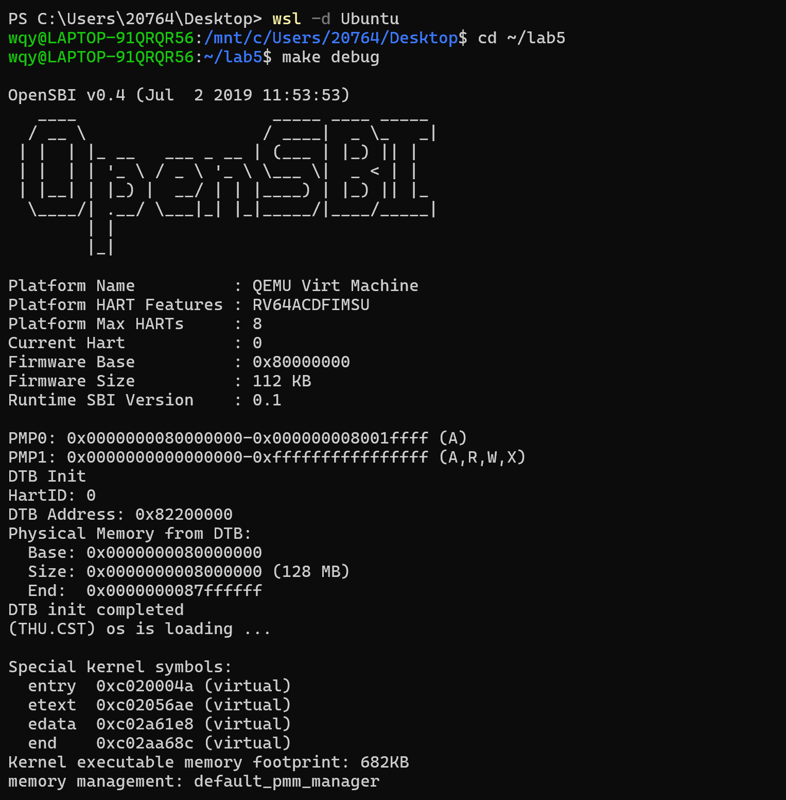

3.3 终端二执行过程
（1）查找QEMU进程ID
输入指令`pgrep -f qemu-system-riscv64`:

可以看到进程ID为2896
（2）以root权限启动GDB
输入指令`sudo gdb`:
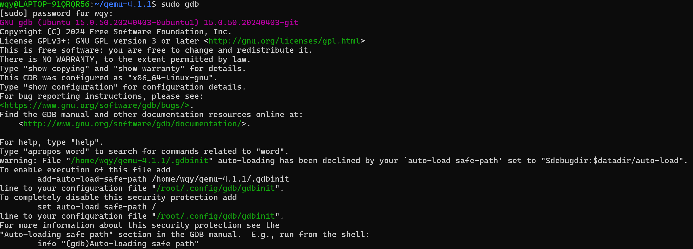
（3）附加到QEMU进程
输入指令`attach 2896`:
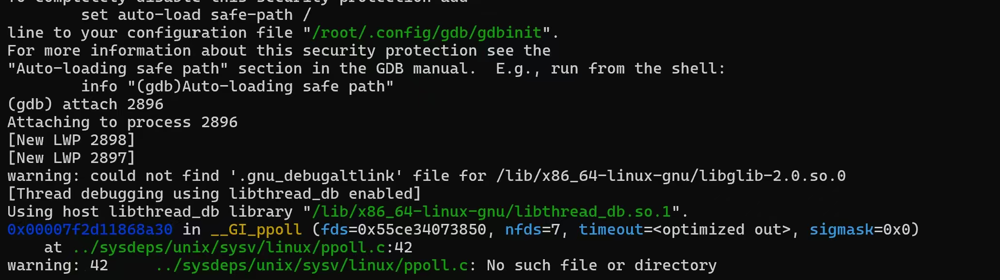
（4）继续运行程序

3.4 终端三执行过程
终端三在终端二执行`continue`指令后运行
（1）启动gdb
输入指令`make gdb`启动gdb，进行调试：
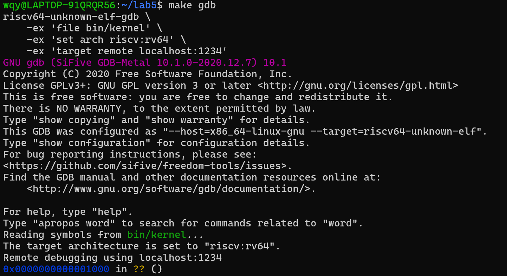
（2）设置远程超时
输入指令`set remotetimeout unlimited`，设置GDB与远程目标的通信超时为无限，避免因响应慢而断开连接：

（3）加载用户程序符号
输入指令`add-symbol-file "obj/__user_exit.out"`，加载用户程序__user_exit.out的调试符号，这样就可以在用户程序中设置断点和查看源代码：
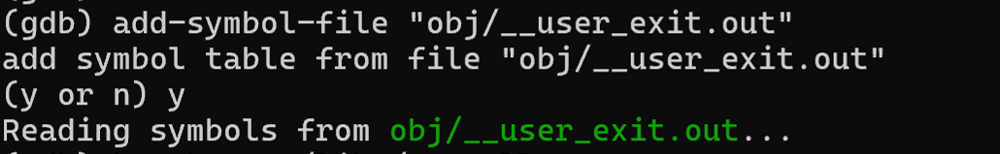

3.5 ecall指令的调试过程
（1）在用户态定位ecall
在终端三中，将断点设置在用户态系统调用函数中，输入指令`break user/libs/syscall.c:18`，执行到断点处停止：
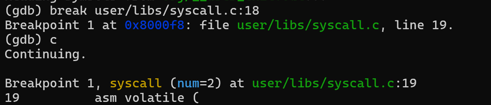
成功停在syscall函数，参数num=2（表示系统调用号为 2）。
输入指令`x/8i $pc`观察当前pc值，估测与指令ecall的距离：
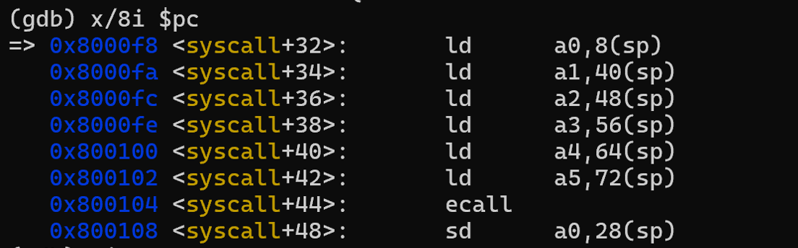
发现还有六条指令，输入指令`si 6`单步执行到ecall之前，同时再次观察当前pc值：
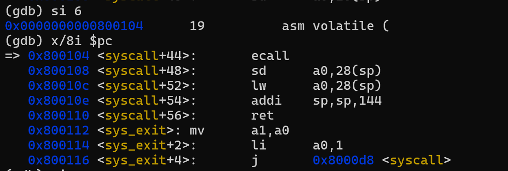
观察到如下指令序列：
0x800104 <syscall+44>: ecall
0x800108 <syscall+48>: sd a0 28(sp)
0x80010c <syscall+52>: lw a0 28(sp)
0x80010e <syscall+54>: addi sp, sp, 144
0x800110 <syscall+56>: ret
0x800112 <sys_exit>: mv a1, a0
0x800114 <sys_exit+2>: li a0, 1
0x800116 <sys_exit+4>: j  0x8000d8 <syscall>
此时PC指向`ecall`指令，寄存器中`a7`保存系统调用号。

（2）单步执行ecall
执行：
（gdb）si
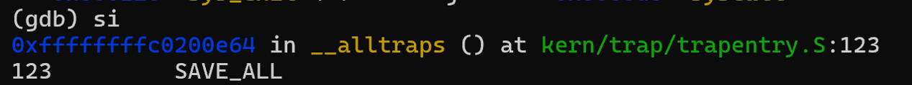
观察到以下现象：
PC并未跳转到`ecall`的下一条指令，而是直接跳转到内核地址空间中的trap入口代码。
这说明`ecall`并非普通顺序执行指令，而是触发了一次同步异常。

（3）观察内核态trap处理
在内核中继续单步执行，检查CSR：
（gdb）p/x $scause
得到：
0x8
表示ECALL from U-mode。(此处忘记截图了，以文字代替)
同时可以验证：
`sepc` 保存的是用户态下一条指令地址；
`sstatus.SPP`记录了异常前的特权级。
这些CSR的变化并非由内核代码手动完成，而是由“硬件行为”触发——在本实验中，即由QEMU模拟的硬件行为完成。

（4）QEMU中对ecall的处理观察
在终端二中attach到QEMU进程。由于实验环境下QEMU未能成功以debug模式重新编译（后文说明），无法直接在`gen_exception`等函数上下断点，因此采用行为观测法。
相关错误如下：
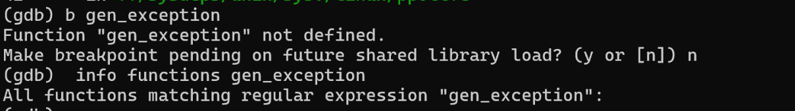
当在终端三执行 `ecall` 时：
1.QEMU立即结束当前翻译块；
2.执行流返回到QEMU主循环；
3.在宿主机GDB中中断执行（Ctrl+C），观察调用栈
在终端二输入指令`bt`进行观察：
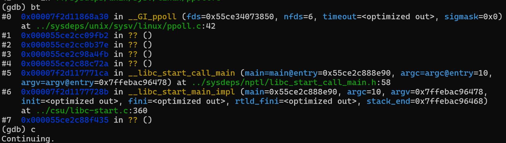
调用栈如下：
__GI_ppoll
qemu_poll_ns
main_loop_wait
main_loop
这表明：
ecall在QEMU中并不会继续执行当前翻译块，而是强制退出TB，将控制权交还给主循环，并以异常的形式重新调度虚拟CPU。

3.6 sret指令的调试过程
（1）定位sret
在内核trap返回路径（如 `trapentry.S`）中，可以观察到：
sret位于133行，设置断点，输入指令为`break kern/trap/trapentry.s:133`，接着输入`continue`执行至断点处：
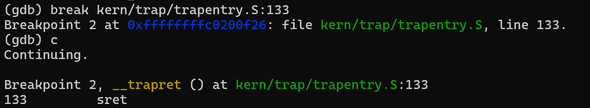

（2）单步执行sret
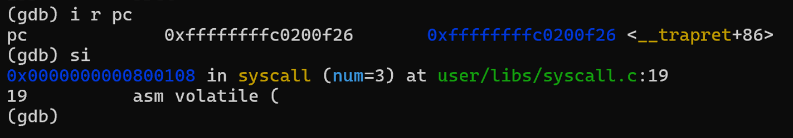
观察到：
PC从内核地址空间直接跳回用户态`sepc`所指地址；
特权级从S-mode恢复到U-mode。

（3）在QEMU侧的现象
在终端二输入指令`bt`，与`ecall`类似，`sret`执行时：
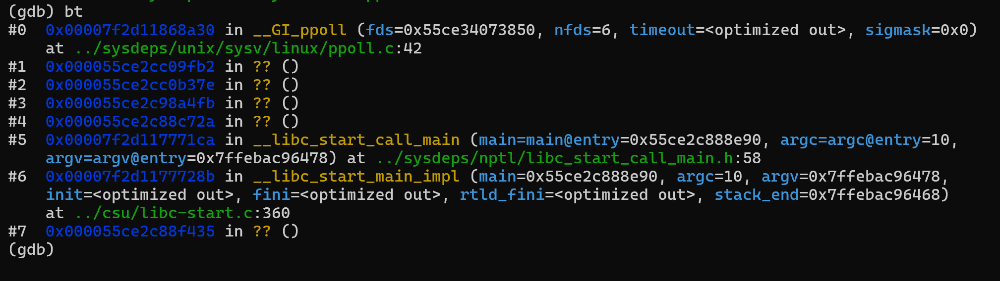
当前翻译块结束；
QEMU回到主循环；
再次根据新的特权级与PC状态生成新的翻译块。
这说明`sret`同样被QEMU视为特权级切换事件，而非普通控制流指令。

四、TCG（Tiny Code Generator）指令翻译机制分析
4.1 TCG的基本作用
TCG是QEMU的核心机制，用于将Guest ISA（RISC-V）指令动态翻译为Host ISA（x86_64）指令：

RISC-V 指令
   ↓
TCG IR（中间表示）
   ↓
x86_64 指令
   ↓
宿主机执行

QEMU并不是逐条解释执行指令，而是以Translation Block（翻译块）为单位进行翻译与缓存。

4.2 ecall/sret在TCG中的特殊性
通过阅读`target/riscv/translate.c`可知：
(1)普通算术/访存指令：
被翻译为一系列TCG IR，顺序执行；
(2)`ecall` / `sret`：
不会生成正常的算术IR，而是：
触发异常或特权级切换；
强制结束当前TB；
交由QEMU的异常与中断处理逻辑处理。

因此，这类指令在TCG中本质上是：“翻译块边界 + 事件触发点”。

五、与另一“双重GDB调试实验”的联系
在另一实验中，同样采用了“Guest GDB + Host GDB”的方式调试系统执行流程。通过本实验可以认识到：
Guest 中的一条 `si`，在 Host 中可能对应：
（1）多条宿主机指令；
（2）一整段 QEMU 函数调用；
（3）特权指令往往是翻译块的天然边界。

因此，两个实验的本质联系在于：
都揭示了QEMU通过TCG实现指令级抽象，而非简单的一对一指令执行。

六、调试过程中的有趣细节与收获
1.QEMU停在 `ppoll`并不代表Guest停止执行，而是说明当前虚拟CPU已执行完一个翻译块，正在等待下一次调度；
2.一条RISC-V指令 ≠ 一条宿主机指令，特权指令往往对应宿主机上的复杂状态机操作；
3.即使没有QEMU调试符号，也能通过行为推断执行逻辑，例如通过TB退出、主循环返回等现象分析内部机制；

七、大模型在实验中的作用与反思
在本实验中，大模型主要在以下方面提供了帮助：
1.调试流程设计
在复杂的三终端、双 GDB 场景下，大模型帮助拆解步骤，避免操作混乱；
2.QEMU源码定位与理解
快速定位 `translate.c`、TCG、翻译块等关键概念；
3.工程问题分析
在QEMU debug编译过程中，多次因内存不足（OOM）失败，大模型帮助判断这是环境限制而非配置错误，并给出替代实验方案；
4.调试问题解决
在QEMU模拟硬件时，总是无法使用函数名打断点致使实验一度无法进行，大模型提出通过观测行为也可以得到调试信息的替代方案。

八、实验总结
通过本实验，系统地观察了`ecall`与`sret`在QEMU中的执行过程，理解了：
特权指令在模拟器中并非普通指令；
TCG翻译机制是QEMU高性能模拟的核心；
双重GDB调试是理解“软件模拟硬件执行”的有效手段。
实验不仅加深了对 RISC-V 特权机制的理解，也加深了对虚拟化与动态翻译系统工作方式的认识。
