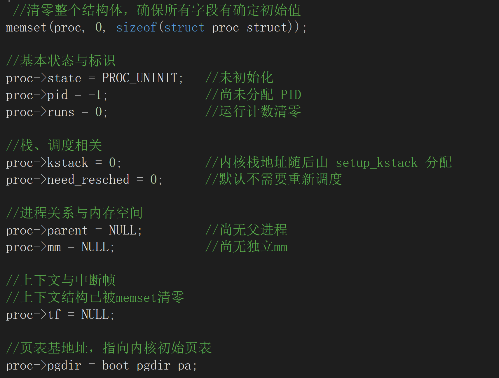
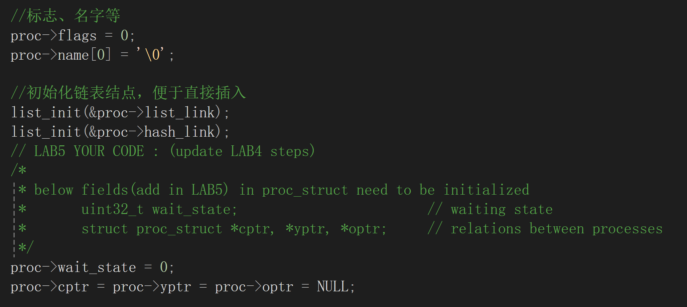
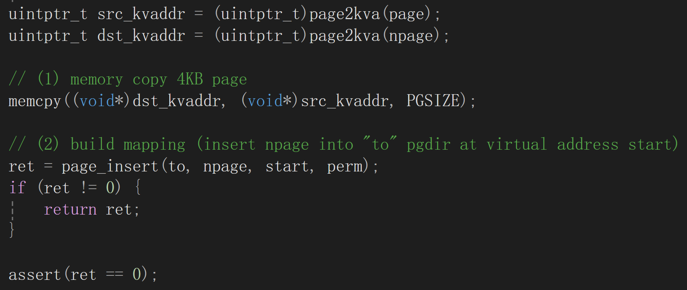
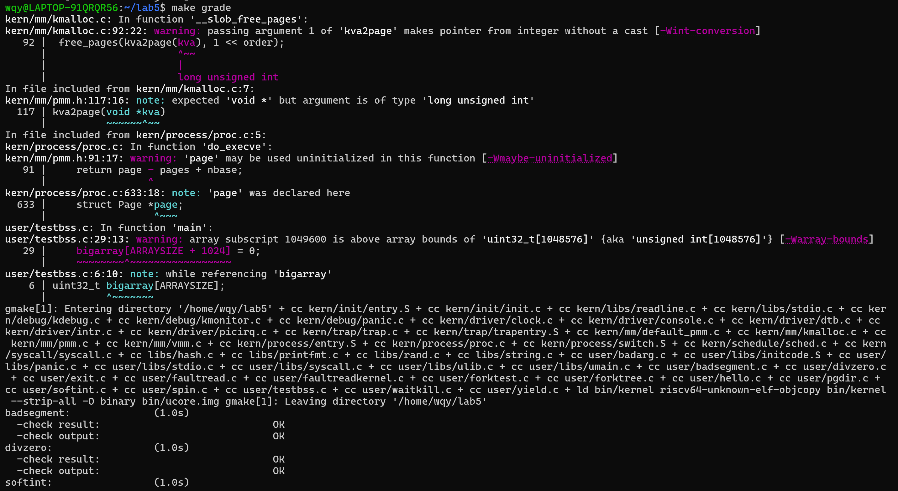
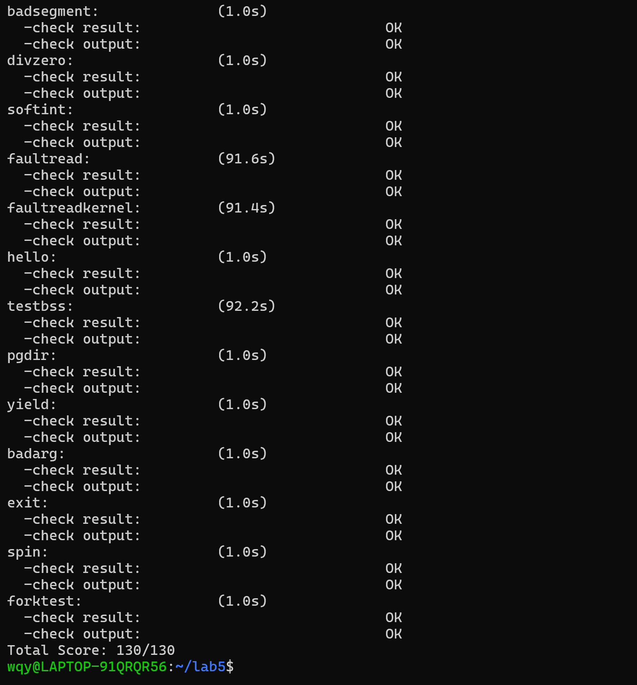

Lab5 实验报告
小组成员：叶喆妍、吴秋媛、李昱
一、实验目的
1.了解第一个用户进程创建过程
2.了解系统调用框架的实现机制
3.了解ucore如何实现系统调用sys_fork/sys_exec/sys_exit/sys_wait来进行进程管理

二、实验环境
实验平台：RISC-V架构  
操作系统内核：uCore

三、实验内容与过程
练习1：加载应用程序并执行
1.1设计与实现思路
do_execve()会调用load_icode()用于加载ELF用户程序。
load_icode()的主要目标是：
1）新建用户页表mm_struct
2）根据ELF Program Header逐段分配物理页，映射到用户虚拟地址空间
3）将用户程序段内容复制到新创建的物理页
4）设置用户栈
5）设置trapframe，使得最终能从用户程序入口地址开始执行
6）建立用户栈并设置trapframe
关键思路如下：
tf->epc = elf_header.e_entry;//设置用户程序入口
tf->gpr.sp = 用户栈顶地址
设置sstatus，使进程运行在U-mode
设置satp，使硬件使用新页表
设置sscratch = 0，便于陷入内核时区分模式
最终保证了进程调度到用户态时，会从ELF指定的第一条指令开始执行。

1.2 用户态进程从READY→RUNNING→执行第一条指令的全过程
1）用户执行exec→触发系统调用→陷入内核
用户程序执行：
exec("/bin/hello")
产生ECALL→CAUSE_USER_ECALL→exception_handler→syscall()→sys_exec()→do_execve()
2）do_execve()调用load_icode()重新构建用户地址空间
清空旧的mm_struct->创建新的页表->加载ELF->复制代码段、数据段->设置用户栈->设置trapframe
3）do_execve()返回→kernel_execve_ret()安排将来从用户态恢复
此时trapframe已准备好，返回前不立即执行用户代码，而是保存状态。
4）调度器schedule()切换进程为RUNNING
通过switch_to切换寄存器。
5）从trapframe恢复上下文→sret→进入用户态第一条指令
trapentry.S中执行 sret：
恢复用户态PC = epc（ELF入口）
恢复用户栈
切换到用户页表SATP
切换到U-mode

此时 CPU 开始执行用户程序的第一条指令。

练习 2：父进程复制自己的内存空间给子进程
2.1copy_range实现
首先查找父进程页表项：
pte_t *ppte = get_pte(from, start, 0);
如果页存在，则申请一页新的物理内存page
复制父页内容到新页
将这页映射到子进程相同虚拟地址
设置PTE权限（可读可写可执行）

2.2Copy on Write（COW）机制设计
1）COW核心思想
fork时不复制物理内存，而是父子共享同一物理页
PTE设置为只读并标记为COW
当父或子尝试写入该页，触发页异常
在页异常处理函数中：
分配新物理页
将旧页内容复制到新页
修改当前进程页表，使其指向新物理页
去掉写保护位

2）COW的关键数据结构修改
struct Page增加引用计数（ref_count）
页表项PTE增加一个标志位PTE_COW
3）COW的copy_range伪代码
if (pte is writable) {
    mark as readonly
    mark as COW
}
increase page.ref_count
map same page into child
4）页异常处理do_pgfault()
if (pte is COW) {
    allocate new page
    copy old page → new page
    pte_write_enable
    map new page
    old_page.ref_count--
}
5）COW优点
fork初始化开销极低，能减少90%内存复制，同时更加符合现代Linux实现

练习 3：分析fork/exec/wait/exit和系统调用实现
3.1执行流程分析
1）fork流程
用户态：
执行fork()
触发ecall→exception_handler→syscall()

内核态：
do_fork中的相关函数执行如下功能：
copy_mm复制或共享地址空间
copy_range复制页内容
setup trapframe设置子进程tf->a0 = 0
最后将子进程加入ready队列

用户态：
子进程fork返回0
父进程fork返回子进程pid

2）exec 流程
sys_exec→do_execve→load_icode
清空旧地址空间
创建新页表
加载 ELF 到内存
重设trapframe→执行新程序入口

3）wait 流程
父进程wait(pid)：
若子进程未退出则当前进程阻塞
若子进程exit，通过wakeup唤醒父进程
4）exit 流程
sys_exit→do_exit
关闭文件
释放内存
设置状态为ZOMBIE
唤醒等待的父进程
调度器切换到其他进程

3.2 内核态与用户态的交错执行
用户态主动调用系统调用→进入内核态执行
中断（时钟、异常）导致被动进入内核态
内核态执行完系统调用或异常处理后通过sret返回用户态
trapframe完整保存并恢复所有寄存器

用户态与内核态通过：
trapentry.S（保存寄存器）
trap.c（处理）
trapentry.S（恢复寄存器）
进行交替。

3.3 用户进程生命周期状态图
                +---------+
                |  INIT   |
                +----+----+
                     |
                     v
              +------+------+
              |   READY     |
              +------+------+
                     |
             schedule() 被调度
                     v
              +------+------+
              |  RUNNING    |
              +------+------+
          ECALL |   ^    | clock interrupt
     exception  |   |    | need_resched=1
                v   |     \
            +---+---+---+   \
            | KERNEL MODE |   \
            +---+---+---+     \
                |   ^          \
                |   | syscall/  \
                |   | trapret    \
                v   |             v
              RUNNING (继续)    READY（被换出）

   exit() →  ZOMBIE → 被父进程 wait() 回收 → FREE

扩展练习Challenge：
2.说明该用户程序是何时被预先加载到内存中的？与我们常用操作系统的加载有何区别，原因是什么？
在实验中，用户程序的加载机制采用了编译时预加载的方式，与常用操作系统（如Linux）的运行时动态加载存在显著区别。
具体而言，uCore在编译阶段将用户程序（如exit.c）的二进制代码直接嵌入内核镜像的数据段，形成以`_binary_obj___user_exit_out_start`和`_binary_obj___user_exit_out_size`为代表的静态符号；当执行`kernel_execve`时，实际是通过`do_execve`调用`load_icode`将已存在于内核数据段的程序代码复制到新分配的用户地址空间，并设置页表映射和用户态执行上下文。相比之下，常用操作系统通常从磁盘动态读取可执行文件，采用按需加载、内存映射文件、支持动态链接和写时复制等复杂机制。
四、运行结果
运行结果如下：

说明功能已经正确实现。
五、重要知识点
（1）实验核心知识点总结
用户进程创建与加载：通过do_execve与load_icode实现ELF格式用户程序的加载，包括物理内存分配、虚拟地址映射、用户栈初始化及中断帧设置，确保进程能够从用户态正确启动执行。
系统调用与特权级切换：用户态通过ecall指令触发异常，内核通过exception_handler分发至具体系统调用处理函数，最终借助sret指令返回用户态，实现了安全的内核与用户态上下文切换。
进程生命周期管理：通过fork、exec、exit、wait等系统调用的协同，完成了进程的创建、程序替换、退出及资源回收，形成了完整的进程管理闭环。
写时复制（COW）优化：在fork操作中通过共享只读物理页并延迟复制，显著降低了进程创建的开销，体现了操作系统内存资源的高效管理策略。
进程状态流转与调度：进程在INIT、RUNNABLE、RUNNING、ZOMBIE等状态间转换，依靠调度器进行上下文切换，时钟中断和系统调用是触发状态转换的关键因素。

（2）实验未涉及的重要操作系统原理知识点
进程同步与通信机制：未涉及信号量、管程等同步原语，以及管道、消息队列、共享内存等进程间通信方式，这些是实现多进程协同与数据交换的基础。
虚拟内存进阶管理：缺少页面置换算法（如LRU）、内存碎片整理、段页式存储管理等机制，这些是处理物理内存不足、优化内存利用率的关键技术。
文件系统与设备管理：未涵盖文件存储、目录结构、权限控制等文件系统功能，以及设备驱动、中断处理等硬件交互机制，简化了操作系统与持久化存储及外设的交互。
调度算法与线程管理：实验采用简单调度策略，未涉及优先级调度、多级反馈队列等进阶调度算法，也未实现线程概念及其管理与同步机制。
系统启动与死锁处理：未详细探讨系统从BIOS/UEFI到内核加载的完整启动流程，以及死锁的检测、避免与恢复策略，这些是操作系统可靠性与稳定性的重要保障。