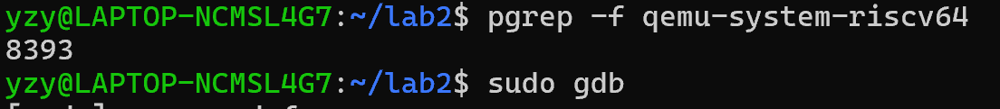
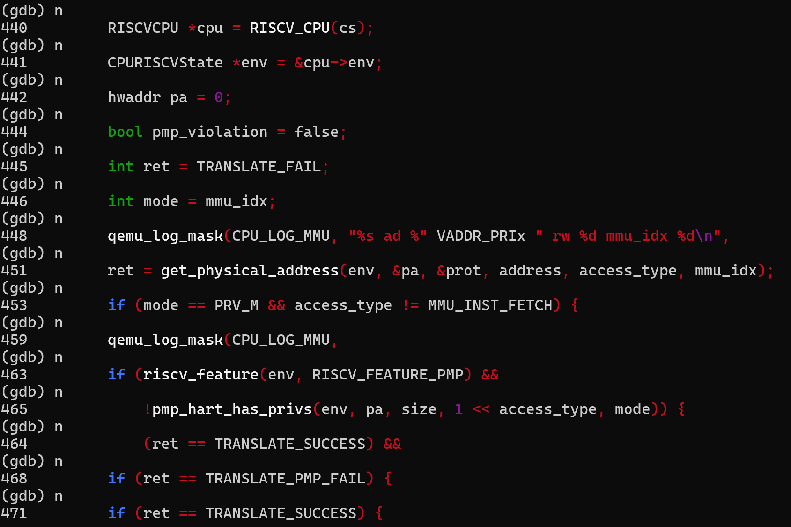
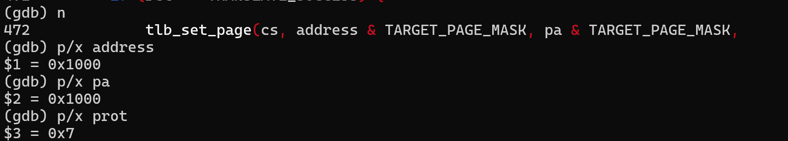
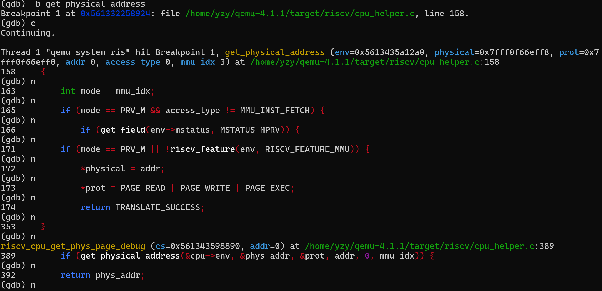
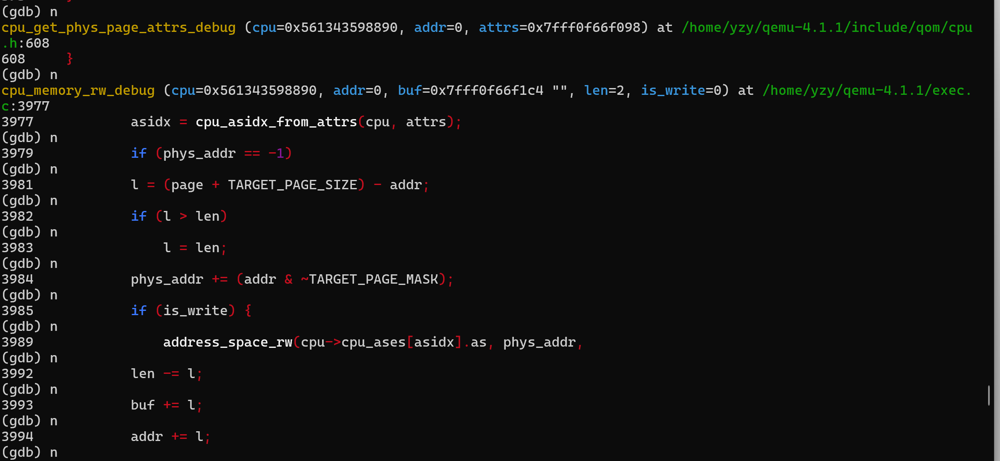
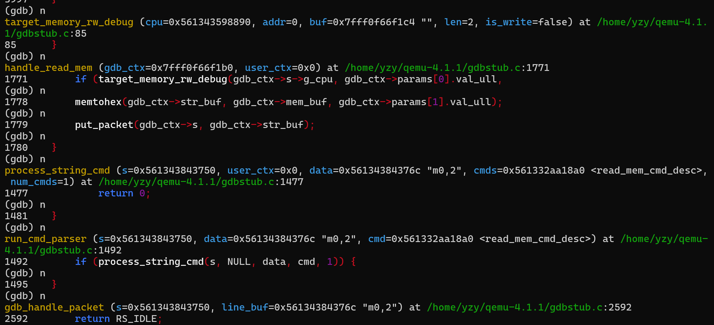
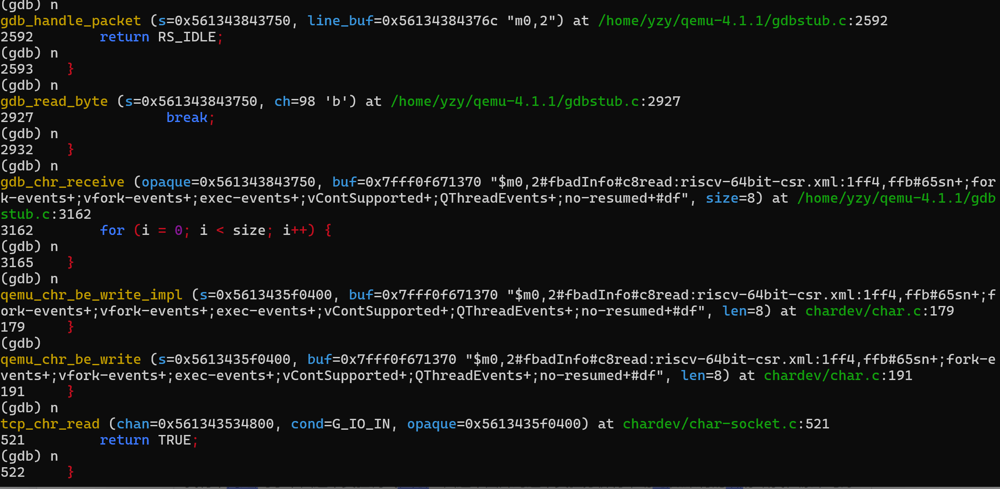
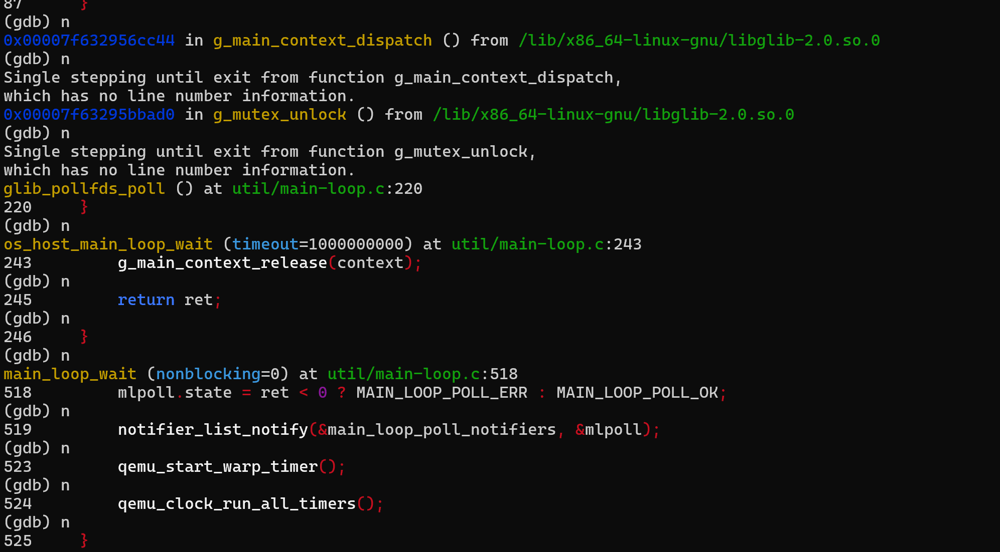

Lab2分支实验报告
小组成员：叶喆妍、吴秋媛、李昱
1.实验步骤：
(1)先根据指导书重新配置gdb，带上调试信息，并修改lab2中ucore的Makefile，让它使用新编译的调试版QEMU；
(2)随后打开三个终端，在第一个终端执行make debug,第二个执行下面的指令，得到当前进程的pid为8393，并启动GDB；

(3)接下来执行下面几条指令，在riscv_cpu_tlb_fill函数处设置断点，继续执行等待程序执行到断点处；在第三个终端中执行make gdb；

(4)第二个终端执行到断点处时，进行单步执行直到tlb_set_page（更新 TLB）前，对于单步执行的具体内容，可以看到451行的内容是：
ret = get_physical_address(env, &pa, &prot, address, access_type, mmu_idx);
这里是虚拟地址转物理地址，入参为address（要转换的虚拟地址）、env（CPU 环境，包含页表信息），而输出为pa（转换后的物理地址）、prot（访存权限），它的作用是通过拆分虚拟地址→查页表→拼接物理地址，把ucore的虚拟地址转成硬件能识别的物理地址。
而471行也就是函数tlb_set_page调用前，是代码if (ret == TRANSLATE_SUCCESS)，这个作用是检查地址转换是否成功：如果成功，就执行tlb_set_page，把新的 “虚拟-物理地址映射” 写入 TLB，方便后续访存直接命中。
472行调用tlb_set_page函数把 “虚拟地址0x1000→物理地址0x1000” 的映射，写入QEMU模拟的TLB中，作用是下次ucore再访存0x1000时，QEMU会直接从TLB里取物理地址（TLB 命中），不用再走页表遍历，提升模拟效率。
执行p/x address，得到$1 = 0x1000，这是ucore当前访存的虚拟地址（比如取指令、读内存的地址），来自ucore的代码执行。
继续执行p/x pa，得到$2 = 0x1000，这是get_physical_address转换后的物理地址。
由于ucore启动阶段用 “虚实地址直接映射”，所以虚拟地址0x1000直接对应物理地址0x1000。
最后执行p/x prot，得到$3 = 0x7，0x7是二进制111，对应可读（R）、可写（W）、可执行（X）权限，这是内核区域的标准权限，内核需要对自身内存有全部操作权。

2.QEMU源码的关键调用路径及分支语句：
(1)关键调用路径
本次调试中，QEMU处理访存指令的核心调用路径为：
riscv_cpu_exec（CPU执行主循环）→riscv_cpu_tlb_fill（TLB未命中时触发）→ get_physical_address（虚拟地址转物理地址）→tlb_set_page（将新映射写入TLB）
(2)路径上的关键分支语句
在riscv_cpu_tlb_fill函数中：
分支1：if(TLB命中)→直接使用TLB中缓存的物理地址（本次调试中首次访存未命中，走分支2）；
分支2：if(TLB未命中)→调用get_physical_address进行页表遍历。
在get_physical_address函数中：
分支1：if(虚拟地址在合法地址空间内)→继续拆分地址查页表；
分支2：if(页表项无效)→返回地址翻译失败（本次调试中页表项有效，走分支1）。
以本次调试中ucore的访存指令为例：
访存虚拟地址：address=0x1000；
QEMU先查TLB：未命中，进入get_physical_address；
拆分虚拟地址：ucore启动阶段是 “虚实地址直接映射”，因此0x1000直接对应物理地址pa=0x1000；
写入TLB：通过tlb_set_page将(0x1000, 0x1000)的映射存入TLB，供后续访存命中。
(3)get_physical_address函数的具体分支逻辑

这一代码分支直接验证了 “ucore 启动阶段虚实地址直接映射” 的设计：内核特权级下，QEMU 会跳过复杂页表遍历，直接将虚拟地址作为物理地址使用，与之前调试中 “address=0x1000→pa=0x1000” 的结果完全对应。
3.页表翻译的关键操作流程
本次调试中，get_physical_address函数是页表翻译的核心实现，而结合QEMU源码的单步调试过程可以看到，ucore启动阶段的页表翻译流程因内核特权级的特性被简化。
函数首先会检测当前CPU的特权级与MMU状态，当处于内核特权级（PRV_M）或MMU未启用时，会直接进入简化分支，将传入的虚拟地址直接赋值为物理地址，并赋予可读、可写、可执行的全权限后返回翻译成功，这正是ucore启动阶段虚实地址直接映射的核心逻辑，也让启动流程避开了复杂的页表遍历操作。
正常页表翻译流程中，函数会将虚拟地址按页表层级拆分为页目录索引、页表索引与页内偏移（一级页表架构下仅拆分为页索引与页内偏移），再从 satp 寄存器读取页表基址，依次访问页目录与页表获取目标页的物理基址，但在本次启动阶段的调试中，这些步骤因内核特权级的简化分支并未实际执行。
最终的物理地址计算环节也随之简化：虚拟地址0x1000的页内偏移为0x1000、页基址为0x0，拼接后得到的物理地址同样是0x1000，与虚拟地址完全一致；而权限检查环节，函数直接为内核态访存分配了全权限（prot=0x7），满足内核启动阶段对内存的全部操作需求，若为用户态访存则会进一步校验页表项的权限位。
4.QEMU中模拟CPU找TLB的C代码+调试细节
QEMU模拟RISC-V CPU查找TLB的逻辑分为两部分：
通用TLB查找：封装在QEMU框架层，逻辑是遍历TLB数组→匹配虚拟地址/ASID→判断命中/未命中；
RISC-V 专属处理：在cpu_helper.c的riscv_cpu_tlb_fill函数中，处理TLB未命中后的页表遍历和TLB填充。
5.QEMU模拟TLB与真实CPU TLB的逻辑区别
从实现方式看，QEMU模拟TLB是通过纯软件遍历数组的方式完成查找，属于串行执行的逻辑；而真实 CPU的TLB是由硬件电路实现的，支持并行查找，因此查找速度很快。在大小上，QEMU模拟TLB的容量通常较小，主要是因为受软件性能的约束，过大的TLB会拖慢模拟效率；真实CPU的TLB大小则由硬件设计决定，硬件本身能支持更大的容量。更新策略方面，QEMU模拟TLB需要软件主动调tlb_set_page函数，才能将新的地址映射写入TLB；而真实CPU的TLB是在发生TLB Miss时由硬件自动完成更新，无需软件层面的干预。功能复杂度上，QEMU模拟TLB并没有硬件级的“TLB 快表+页表慢表”分层延迟设计；而真实CPU会针对TLB做硬件延迟优化，TLB命中与未命中时的执行延迟差异极大。
6.调试中的细节及学到的知识
在调试中发现物理地址和虚拟地址都是0x1000，本来以为可能是出错了，后来通过学习了解到是ucore启动阶段的“虚实地址直接映射”：首次访存虚拟地址0x1000时，物理地址也是0x1000，这是内核为了简化启动流程的设计，避免早期页表复杂映射；
QEMU是软件模拟硬件，原来CPU的TLB、页表遍历这些硬件逻辑，都可以通过C语言的数组、函数调用实现；访存指令的硬件级地址转换，本质是QEMU在软件层做的地址查表+计算。
另外，在调试时，顺着get_physical_address函数继续向下执行，看到cpu_memory_rw_debug、handle_read_mem等函数，询问大模型得到，在 GDB 里输入p/x address实际是 GDB 先给 QEMU 发了个 “查询内存” 的请求包，QEMU 先调用和正常执行时完全一样的get_physical_address做地址翻译，再从模拟内存里取数据，最后通过put_packet把结果打包、走字符设备发回给 GDB。等于 QEMU 在中间当了个翻译，一边接 GDB 的调试命令，一边接模拟的硬件逻辑，这才让我们能看到硬件级的信息，最后还注意到，处理完 GDB 的请求后，QEMU 会跳回g_main_context_dispatch、main_loop_wait这些主循环函数，继续处理定时器、I/O 事件，模拟器在调试的同时，后台还在维持自身的运行节奏。
 
 
 

7.大模型解决的问题
问题 1：工具链找不到（riscv64-unknown-elf-gdb: No such file or directory）
执行make gdb时提示工具链不存在，不确定是工具链未安装还是路径未配置；向大模型描述错误，得到 “全局搜索工具链路径 + 导出环境变量” 的方案，最终找到/home/yzy/riscvtool/bin并解决。
问题 2：断点pgdir_walk未定义在 ucore 的 GDB 中设置页表函数断点失败，怀疑函数名不符，但不确定 ucore 实际的页表函数名；向大模型说明情况，得到 “先设内核入口断点，等符号加载后再设页表断点” 的方案，同时了解到不同 ucore 分支函数名可能不同，最后发现还是符号加载的问题，由于没有符号加载，无法识别函数名，加载后成功找到。