Lab6实验报告
小组成员：叶喆妍 吴秋媛 李昱
一、实验目的

理解操作系统的调度管理机制
熟悉 ucore 的系统调度器框架，实现缺省的Round-Robin 调度算法
基于调度器框架实现一个(Stride Scheduling)调度算法来替换缺省的调度算法

二、实验环境

操作系统：uCore
文件系统：Simple File System（SFS）
硬件架构：RISC-V
运行环境：QEMU

三、实验内容
1.练习 0：填写已有实验并完成适配修改

（1）进程控制块（PCB）的初始化改动
在 lab6 中，进程控制块 `proc_struct` 新增了与调度相关的字段，如下：
`time_slice`：当前进程剩余时间片  
`need_resched`：是否需要重新调度  
与 stride 等算法相关的优先级信息  
因此，在进程创建与初始化过程中，需要对上述字段进行初始化，避免调度过程中出现未定义行为。
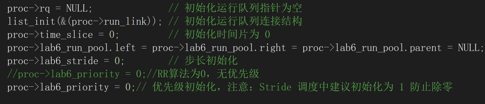

（2）时钟中断处理的调整
Round Robin 调度算法依赖周期性的时钟中断来减少当前进程的时间片。在时钟中断处理流程中，需要确保：
每次时钟中断都会调用调度类的 `proc_tick` 函数  
当时间片耗尽时，通过设置 `need_resched` 标志触发调度  
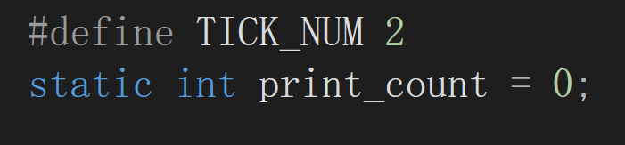
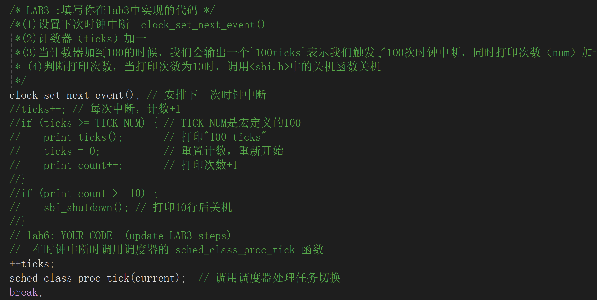
将TICK_NUM设置为2，保证时钟中断的周期性，同时将print_count设置为0，防止打印中断后自动关机。在每次时钟中断调用 `proc_tick` 函数。

2.练习 1：调度器框架的实现分析

2.1 `sched_class` 结构体分析

`sched_class` 是调度器框架的核心抽象，其通过函数指针定义了一组调度算法接口，包括：

`init`：初始化调度器私有数据结构，用于在创建 runqueue 或系统启动时设置队列状态和策略相关的额外数据结构。
`enqueue`：进程进入就绪队列，当进程被唤醒或创建时调用，用于将进程按照策略放入队列的适当位置。
`dequeue`：进程离开就绪队列，当进程阻塞或终止时调用，用于将进程从队列中移除。
`pick_next`：选择下一个运行进程，在调度时调用，用于根据调度策略选择合适的下一个进程。
`proc_tick`：处理时钟中断对当前进程的影响，每个时钟中断触发时调用，用于更新时间片、虚拟运行时间或触发抢占等策略相关操作。

这些接口以函数指针的形式存在，使得调度器框架与具体调度算法解耦。通过函数指针，不同调度策略可以实现自己的逻辑而无需修改核心调度器代码，从而方便调度算法的扩展、切换和多核环境下的负载均衡支持。

2.2 `run_queue` 结构体分析

在 lab5 中，`run_queue` 仅用于基本调度，主要依赖链表结构；而在 lab6 中，为了支持 RR 与 stride 等不同调度算法，`run_queue` 同时支持链表与斜堆等数据结构，引入了斜堆（lab6_run_pool）用于高效选择最小虚拟运行时间的进程，同时保留链表以兼容其他策略。这种设计提高了调度框架的通用性与扩展性。

2.3 调度器框架函数分析

`sched_init()`：完成调度器初始化，设置默认调度类并初始化运行队列  
`wakeup_proc()`：将阻塞进程唤醒并通过调度类接口加入就绪队列  
`schedule()`：根据 `need_resched` 状态触发调度，并调用调度类接口选择新进程  

在Lab6中，调度器通过sched_class实现了调度算法接口化，从而将调度流程与具体算法解耦。sched_init()用于选择调度策略并初始化runqueue，wakeup_proc()在唤醒进程时通过 sched_class_enqueue()将其加入就绪队列，而schedule()则通过sched_class_pick_next()和sched_class_dequeue()选择并运行下一个进程。与Lab5直接遍历全局进程链表不同，Lab6调度器不依赖具体队列结构或算法实现，使不同策略能够灵活切换，既提高了调度器的可扩展性，也便于多策略和多核环境下的调度管理。

2.4 调度类初始化流程

（1）内核启动  
（2）调用 `sched_init()`  
（3）设置 `default_sched_class`  
（4）初始化运行队列  
（5）调度器进入可用状态  
在内核启动过程中，首先完成基础硬件初始化和进程管理子系统的建立。当调度器初始化时，sched_init()被调用以设置调度策略和初始化运行队列（run_queue）。在默认配置下，sched_class被指向default_sched_class，即RR调度器类，其结构体封装了与时间片轮转调度相关的各个函数接口，包括RR_init、RR_enqueue、RR_dequeue、RR_pick_next和RR_proc_tick。随后，sched_class->init(rq)被调用，初始化runqueue中的策略私有数据结构。此后，调度器便可通过统一的函数接口管理进程，而不依赖具体的调度算法实现。通过这种设计，default_sched_class与调度器框架建立了关联，使核心调度器能够透明地执行RR策略，同时保持对其他调度策略的可扩展性和切换能力。

2.5 进程调度流程

（1）时钟中断触发  
（2）调用当前调度类的 `proc_tick`  
（3）减少当前进程时间片  
（4）时间片耗尽，设置 `need_resched`  
（5）返回中断后进入 `schedule()`  
（6）调用 `pick_next` 选择新进程并完成上下文切换  
`need_resched` 用于延迟调度，避免在中断上下文中直接切换进程。

流程图如下：
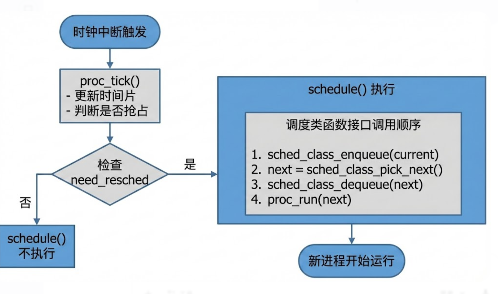

2.6 调度算法的切换机制

首先，需要实现该调度算法对应的调度类，即定义一个新的sched_class实例（如 stride_sched_class），并分别实现其init、enqueue、dequeue、pick_next和proc_tick等接口函数，用于描述该算法对运行队列的管理和进程选择逻辑。其次，如该算法需要特殊的数据结构（例如 Stride 调度需要使用斜堆以高效选取最小stride值的进程），只需在run_queue中增加相应字段，并在调度类的init与相关接口中维护即可。最后，在调度器初始化函数sched_init()中，将sched_class指针指向新定义的调度类，即可完成调度算法的切换，而无需修改schedule()、wakeup_proc()等核心调度流程代码。
这种设计之所以使调度算法的切换变得容易，是因为调度器采用了基于sched_class的接口化和模块化设计思想。核心调度器只通过统一的函数指针接口操作运行队列，而不依赖任何具体调度算法的实现细节。不同调度算法以“插件”的形式存在，通过替换sched_class指针即可生效，从而实现了调度流程与调度策略的解耦，显著提高了调度器的可扩展性和可维护性。

3.练习 2：Round Robin 调度算法实现

3.1 lab5 与 lab6 实现差异分析

以`schedule()`为例，在Lab5中，schedule()函数直接遍历进程链表并选择下一个可运行进程，调度策略与调度流程紧密耦合，难以扩展。在Lab6中，schedule()被重构为仅负责调度流程控制，通过调用sched_class提供的enqueue、pick_next和dequeue接口完成进程调度，从而将调度算法与核心调度器解耦。该改动使得不同调度算法可以独立实现并灵活切换，否则新调度算法将无法接入，且复杂数据结构（如斜堆）无法被正确使用。如果不进行该改动，将导致调度算法难以扩展与维护。

3.2 函数实现思路

RR_init：用于初始化运行队列，其通过 list_init 将就绪队列设置为空链表，并将进程计数器 proc_num 置零。由于 RR 调度不依赖额外的复杂数据结构，因此初始化过程较为简单，仅需保证链表和元数据处于一致状态。
RR_enqueue：负责将进程加入就绪队列。在入队前通过断言保证进程未处于任何运行队列中，防止重复入队。由于 RR 调度要求进程按照进入队列的先后顺序轮流执行，进程节点被插入到链表尾部（哨兵节点之前），从而保持 FIFO 语义。同时，对进程的时间片进行合法性检查，当时间片耗尽或数值异常时重新赋予最大时间片，以正确处理被抢占或重新唤醒的进程。入队完成后更新运行队列中的进程数量。 
RR_dequeue：用于将进程从运行队列中移除。在删除前检查进程确实属于当前运行队列，随后使用 list_del_init 将节点安全地从链表中删除并重新初始化其指针，避免产生悬空引用。出队后清空进程的运行队列指针并同步更新队列中的进程计数。
RR_pick_next：用于选择下一个运行进程。RR 调度始终选择队首进程运行，因此通过访问链表中哨兵节点后的第一个元素来获得候选进程。当运行队列为空时返回 NULL，由调度器上层逻辑选择空闲进程 idleproc 运行，从而保证系统的正确执行。  
RR_proc_tick：在每次时钟中断发生时被调用，用于维护当前进程的时间片。函数在保证时间片不为负的前提下递减其值，当时间片耗尽时设置 need_resched 标志位，通知调度器在合适的时机进行进程切换。这种延迟调度方式避免了在中断上下文中直接进行上下文切换，提高了系统运行效率。
边界处理：
RR调度算法通过通过断言和状态检查有效处理了空队列、重复入队和非法时间片等边界情况。同时，该实现遵循调度类接口规范，与调度器框架保持良好解耦，便于后续扩展与维护。

3.3 make grade 输出结果

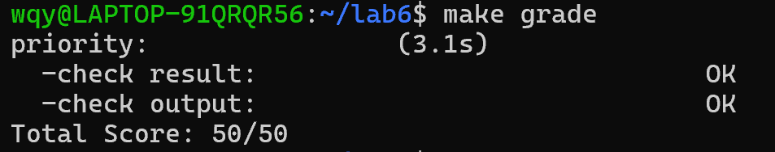
在Lab6中实现RR调度算法并运行用户程序时，通过QEMU可以观察到以下调度现象：
（1）调度算法的运行
在QEMU模拟的虚拟机环境中，调度器采用了RR算法。通过观察进程的切换，可以看到所有就绪的进程被按顺序轮流执行，每个进程的运行时间受限于时间片的长度。当时间片耗尽时，当前进程被抢占，调度器选择下一个就绪队列中的进程执行。
（2）进程时间片的管理
每个进程按照预设的时间片长度被分配 CPU 时间。在时间片用完后，调度器通过调用 RR_proc_tick 来触发进程状态的更新，并将 need_resched 标志设置为 1，标识当前进程需要调度。这样一旦时间片用尽，进程会被放回队列，等待再次调度。
（3）调度顺序的验证
可以通过 QEMU 输出中的调度信息（例如 sched class: RR_scheduler）确认系统实际正在使用 Round Robin 调度算法。
进程切换的顺序与算法预期一致：进程按轮流顺序执行，时间片用尽后下一个进程开始执行，且总是会轮回到 idleproc 进程，表明系统在空闲时会执行空闲进程。

3.4 RR调度算法优缺点分析

（1）优点：
简单易实现：Round Robin 算法是最简单的时间片轮转调度算法。它确保每个进程获得平等的 CPU 时间，这使得算法实现非常直观且易于理解。
公平性：所有就绪进程在每个调度周期内都会获得相等的 CPU 时间，避免了某些进程因计算量大或长时间占用 CPU 而导致饿死的现象。因此，RR 算法是非常公平的，特别适合多任务环境。
适应性强：由于每个进程都有固定的时间片，系统能够有效地响应大量短作业和交互式任务的需求，避免了处理长作业时对其他进程造成的长时间占用问题。
（2）缺点：
上下文切换开销大：RR 算法依赖于频繁的上下文切换。在时间片到期或进程被抢占时，系统需要保存和恢复进程的状态，这会产生较大的上下文切换开销。尤其在时间片过短时，频繁的上下文切换会显著影响系统性能。
响应时间不稳定：如果时间片设置过长，系统的响应时间会变差，尤其是在存在许多交互式进程的情况下。而如果时间片过短，频繁的上下文切换可能使得进程的 CPU 时间分配不合理，从而造成响应时间的不稳定。
不适用于长任务：对于计算密集型的长任务，RR 算法会导致进程不停地被中断。每个进程都会被迫频繁进行上下文切换，导致这些长任务的效率低下。

3.5 如何调整时间片大小来优化系统性能？

（1）时间片过小
问题：时间片过小导致频繁的上下文切换，浪费了大量的 CPU 时间在保存和恢复进程状态上。这对于长时间运行的任务不利，增加了调度的开销。
优化：应该增加时间片大小，减少不必要的上下文切换，使得每个进程有足够的执行时间来完成任务，避免频繁切换带来的开销。
（2）时间片过大
问题：如果时间片设置得过长，进程会占用过多的 CPU 时间，导致系统的响应时间变长，尤其是对于短小的交互式任务来说。
优化：缩小时间片的长度，使得每个进程能更频繁地进行切换，从而保证系统对交互式任务的响应性，避免某些进程长期占用 CPU。
（3）动态调整
问题：固定的时间片可能不适应不同工作负载的需求。对于 I/O 密集型进程，较短的时间片会导致过多的上下文切换；对于计算密集型进程，较长的时间片可以提高效率。
优化：可以考虑根据系统负载和进程的类型动态调整时间片的大小。例如，可以根据 CPU 使用情况或者进程的类型（I/O 密集型或计算密集型）来调整时间片的长度，从而实现更合理的资源分配。

3.6 为什么需要在 RR_proc_tick 中设置 need_resched 标志？

在 RR_proc_tick 中设置 need_resched 标志是为了在进程的时间片用尽时触发调度，从而确保系统能够及时进行上下文切换，选择下一个需要运行的进程。

作用与原因：
（1）标识时间片耗尽
每当进程的时间片耗尽时，RR_proc_tick 会将 need_resched 标志设置为 1。这表明当前进程已不再可继续执行，需要调度器做出相应的处理。
（2）触发调度
设置 need_resched 标志后，调度器在下一次调用时会检查这个标志，从而决定是否需要进行进程切换。如果不设置 need_resched，即使时间片已经耗尽，调度器也无法得知需要切换进程，导致系统无法及时调度新的进程。
（3）支持抢占机制
在多任务系统中，抢占式调度是常见的设计理念。need_resched 标志位使得调度器能够在时间片到期后立即进行进程调度，从而支持抢占式调度，提高系统的响应能力。
（4）实现公平的时间片分配
如果没有 need_resched 标志，进程可能会在时间片耗尽后继续占用 CPU，导致其他就绪进程无法及时获得 CPU 时间。设置 need_resched 可以确保所有进程都按轮流的方式公平地占用 CPU，避免某些进程饿死。

3.7拓展思考

在 RR调度算法的基础上实现优先级调度，我们可以给每个进程分配一个优先级值，然后在轮转调度时，优先选择优先级高的进程先执行。

代码修改步骤：
（1）为每个进程添加优先级字段
在 proc_struct 结构体中，添加一个 priority 字段，用于存储进程的优先级值。优先级值越大，表示该进程的优先级越高。
struct proc_struct {
    // 原有字段
    int priority;  // 新增字段，表示进程的优先级
};
（2）修改 RR_enqueue 函数
在进程入队时，我们需要根据优先级调整其位置。在当前的RR算法实现中，进程被插入到队列的末尾。如果要支持优先级调度，需要将新进程插入到队列中的合适位置，使得优先级高的进程排在前面。
修改 RR_enqueue 函数，按优先级插入进程：
static void RR_enqueue(struct run_queue* rq, struct proc_struct* proc) {
    assert(list_empty(&(proc->run_link)));
    // 如果进程的优先级小于队列中第一个进程的优先级，插入队列头部
    list_entry_t *le = list_next(&(rq->run_list));
    while (le != &(rq->run_list) && le2proc(le, run_link)->priority >= proc->priority) {
        le = list_next(le);
    }
    // 将进程插入到合适的位置
    list_add_before(le, &(proc->run_link));
    proc->rq = rq;
    rq->proc_num++;
}
（3）修改 RR_pick_next 函数
在选择下一个执行的进程时，依旧采用队列中的第一个进程，但需要确保进程是按优先级排好序的。此时，RR_pick_next 的实现不再有任何修改，因为入队时已经按照优先级调整了队列。
（4）更新 RR_proc_tick
RR_proc_tick 不需要特别修改，因为优先级与时间片轮转调度并没有直接关系。进程的时间片耗尽后会进行调度，但在 need_resched 被设置时，调度器会根据优先级来选择下一个进程。
（5）修改调度器的调度类设置
在初始化调度类时，确保我们使用的是新的优先级调度算法，而不是原来的普通RR调度算法。
struct sched_class priority_sched_class = {
    .name = "Priority_RR_scheduler",
    .init = RR_init,
    .enqueue = RR_enqueue,
    .dequeue = RR_dequeue,
    .pick_next = RR_pick_next,
    .proc_tick = RR_proc_tick,
};

当前实现是否支持多核调度？
当前的实现 不支持多核调度。现有的 Round Robin 算法仅适用于单核系统，进程的调度是顺序进行的，并没有考虑到多核处理器的并行性。

如何支持多核调度？
为了支持多核调度，我们需要对现有的调度算法进行以下改进：
（1）引入多核处理器的概念
每个 CPU 核心都有自己的运行队列和调度器。在多核系统中，每个核应该有自己的 run_queue，并且每个进程会绑定到一个具体的 CPU 核心上。
（2）进程的 CPU 核心绑定
每个进程需要知道它当前在哪个 CPU 核心上运行，并且在多核调度中，进程可以在不同的 CPU 核心之间迁移。例如，某个进程的 cpu_id 字段用于表示其当前所在的 CPU 核心。
struct proc_struct {
    // 原有字段
    int cpu_id;  // 表示进程当前运行的 CPU 核心
};
（3）多核调度的核心变化
调度时，每个 CPU 核心都应该独立地选择自己核内的下一个进程，并根据 run_queue 中的进程进行调度。
为了避免在多个核上调度同一个进程，可以增加一个机制，确保每个进程只在一个核上运行，或者在进程迁移时进行适当的同步。
（4）修改 schedule 函数以支持多核调度
我们需要确保每个 CPU 核心都能够独立进行进程调度。在多核调度中，每个核将运行独立的 schedule 函数，而不是一个全局的调度函数。
void schedule_on_cpu(int cpu_id) {
    struct run_queue* rq = &cpu_run_queue[cpu_id];  // 每个CPU有自己的调度队列
    struct proc_struct* next = RR_pick_next(rq);
    // 调度逻辑与现有的调度类似
    if (next != NULL) {
        RR_dequeue(rq, next);
        proc_run(next);  // 切换到下一个进程
    }
}
（5）处理进程迁移
在多核系统中，如果某个进程的时间片耗尽，可能会选择切换到其他 CPU 核心上执行。这时需要考虑如何在核心之间迁移进程，并更新进程的 cpu_id。
进程迁移时，需要重新考虑进程的优先级、时间片等参数。
如果某个核心的进程过多，系统可以选择将一部分进程迁移到负载较低的其他核心。

四、扩展练习
4.1 Challenge 1：Stride Scheduling 调度算法

1.设计背景与目标

Round Robin 调度算法虽然实现简单、具有较好的公平性，但无法根据进程的重要程度分配不同的 CPU 时间比例。为了解决这一问题，本实验在统一调度器框架下实现了Stride Scheduling 调度算法，其核心目标是：
根据进程优先级，按比例分配 CPU 时间
保证长期运行中各进程获得的 CPU 时间与其优先级成正比
在保持调度器框架不变的前提下，实现可扩展的调度策略切换

2.Stride 调度算法的核心思想

Stride 调度算法为每个进程维护一个 stride 值，表示该进程“已经消耗的虚拟 CPU 时间”。调度时，总是选择 stride 值最小的进程运行。

其基本规则为：
为每个进程分配一个优先级 `priority`
定义一个常量 `BIG_STRIDE`
每次进程被调度运行后，更新：
stride += BIG_STRIDE / priority
优先级越高，stride 增长越慢，因此在未来更容易再次被选中运行，从而获得更多的 CPU 时间。

3.调度器整体实现流程

在实现上，Stride 调度器完全复用 lab6 提供的调度器框架，仅通过实现新的 `sched_class` 来完成：
（1）切换调度器
在 `sched_init()` 中，将调度类从 `default_sched_class`（RR）切换为 `stride_sched_class`
（2）运行队列组织方式
使用斜堆作为优先队列
堆的比较依据为进程的 `lab6_stride` 值
（3）关键接口实现
`stride_enqueue`：将进程插入斜堆
`stride_pick_next`：选择 stride 最小的进程
`stride_dequeue`：从斜堆中移除进程
`stride_proc_tick`：处理时间片耗尽，触发调度
通过这一方式，调度器框架无需任何修改，即可支持新的调度算法，体现了良好的模块化与解耦设计。

代码实现如下：
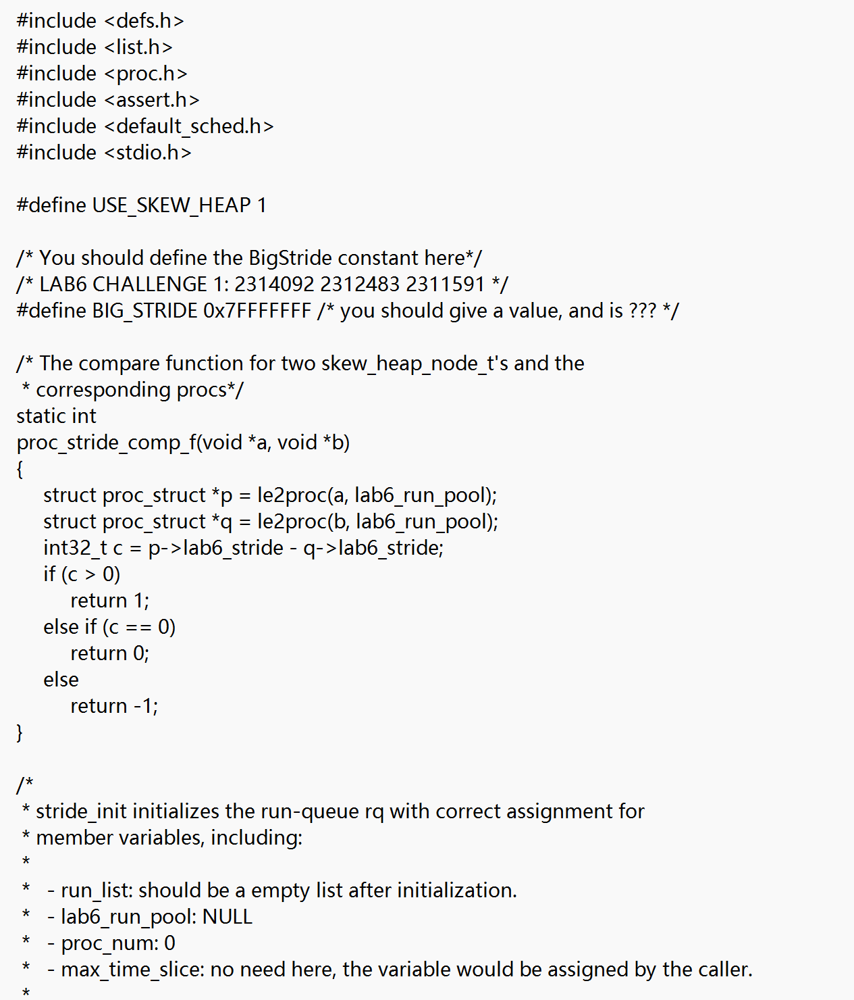
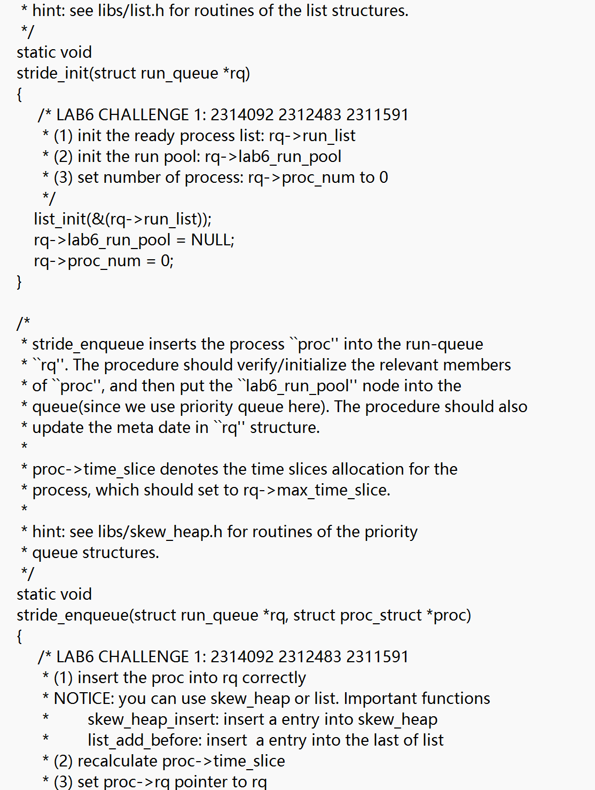
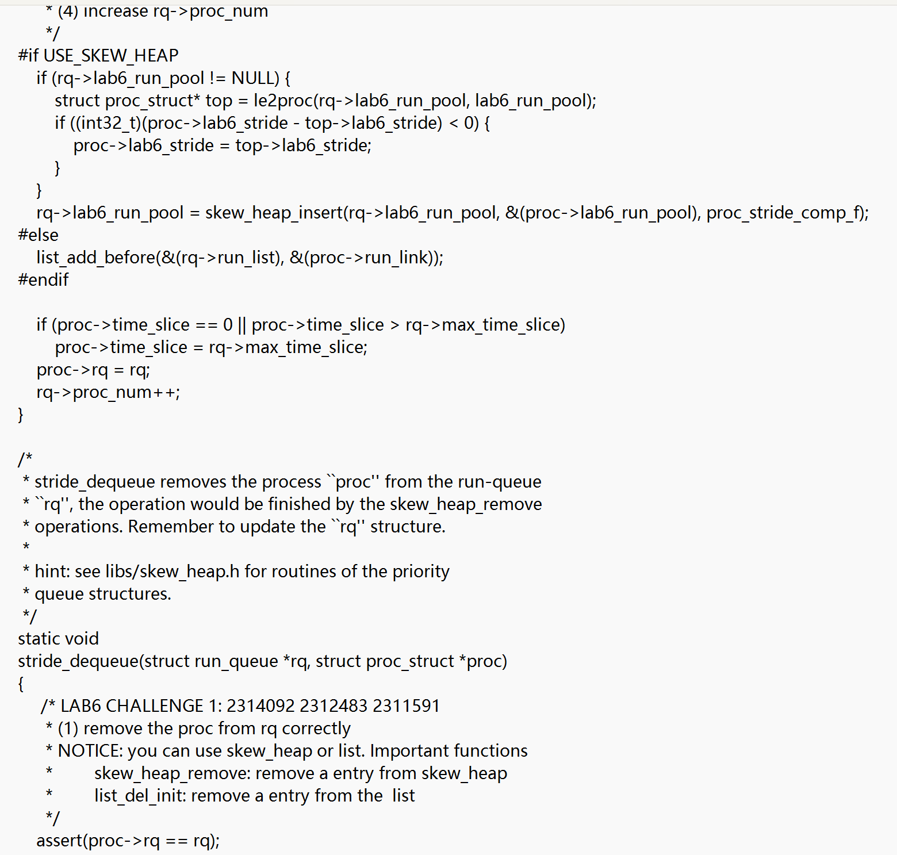
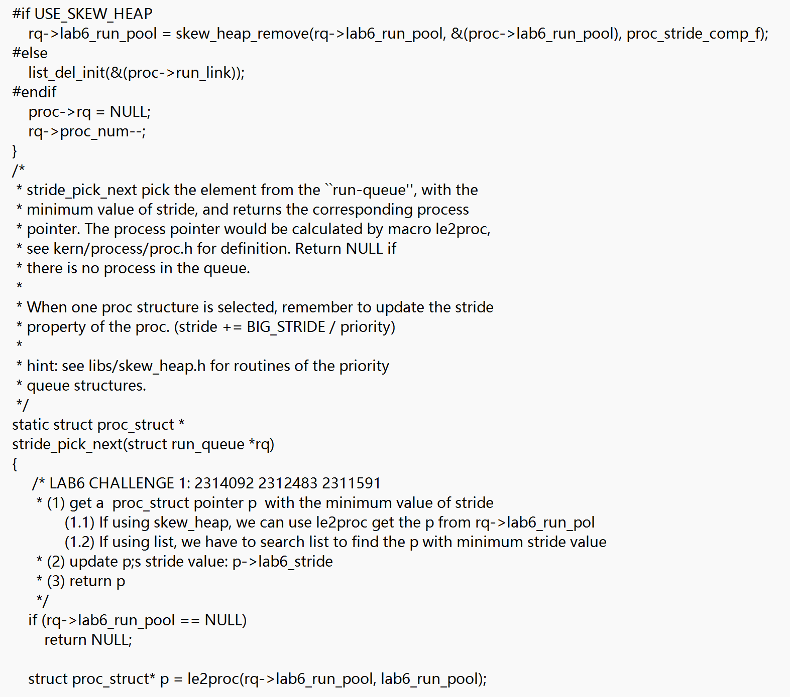
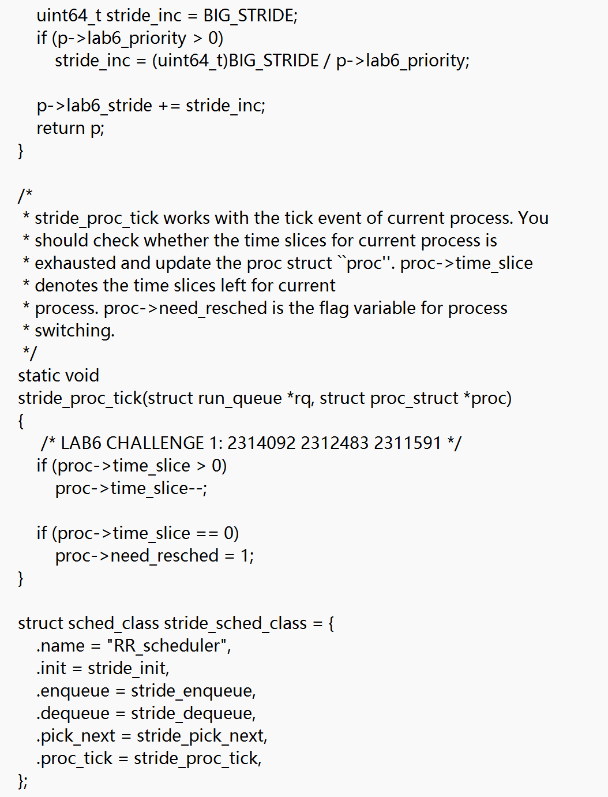

4.Stride 调度算法公平性的直观说明
回答：为什么 Stride 调度算法能够保证 CPU 时间与优先级成正比？

（1）基本假设
假设系统中存在多个长期运行的进程，且：
每个进程在每次被调度后都会执行一个时间片
调度器始终选择 stride 最小的进程运行
所有进程持续处于可运行状态
（2）Stride 增长速度的对比
对于进程 i，其 stride 增量为：
Δstride_i = BIG_STRIDE / priority_i
这意味着：
优先级高 → stride 增长慢
优先级低 → stride 增长快
因此，高优先级进程在多次调度后，stride 值仍然较小，更容易被再次选中。
（3）长期运行后的效果
在经过足够多次调度后：
所有进程的 stride 值会在一个相近的范围内波动
某个进程的 stride 每增加一次，意味着它“消耗了一次 CPU 机会”
由于 stride 增长速度与 `1 / priority` 成正比，因此：
进程获得 CPU 时间片的次数，与其优先级成正比
这使得 Stride 调度算法在长期尺度上实现了“比例公平”。
（4）与 Round Robin 的对比
Round Robin：每个进程获得几乎相同数量的时间片
Stride：每个进程获得的时间片数量由优先级决定
Stride 可以视为 RR 的一种“加权公平”扩展。

5.多级反馈队列（MLFQ）调度算法的设计思路

（1）设计目标
多级反馈队列（Multi-Level Feedback Queue, MLFQ）调度算法的目标是：
兼顾响应时间与吞吐量
根据进程的运行行为动态调整其优先级
区分 CPU 密集型进程与 I/O 密集型进程
（2）概要设计
MLFQ 可按如下方式设计：
多个优先级队列：
系统维护多个就绪队列，每个队列对应一个优先级
高优先级队列先被调度
不同时间片长度：
高优先级队列：时间片短（快速响应）
低优先级队列：时间片长（减少切换开销）
动态反馈机制：
若进程在一个时间片内主动让出 CPU（如等待 I/O），则提升优先级
若进程耗尽时间片，则降低优先级
（3）详细设计思路
在 lab6 的调度器框架下，可按如下方式实现：
使用多个 `run_queue` 或一个包含多个链表的结构
在 `enqueue` 时根据进程当前优先级选择对应队列
在 `proc_tick` 中根据进程行为调整其优先级
在 `pick_next` 中按优先级从高到低查找可运行进程

4.2扩展练习 Challenge 2 ：其他基本调度算法(FIFO/SJF)及测试用例（文件为fifo_test.c和sjf_test.c）

1.FIFO（First-In-First-Out）
原理：按进程创建顺序调度，先进入就先执行，非抢占式。
特点：实现简单，对所有进程公平，可能导致长作业阻塞短作业

2.SJF（Shortest Job First）
原理：每次选择 估计运行时间最短的进程 执行，非抢占式。
特点：平均等待时间最短，对短作业非常友好，需要事先知道或估计作业长度

3.测试用例设计与理由
在本实验中，重点验证 FIFO 与 SJF 调度算法在不同作业长度下的行为差异。为此，我们设计了三个用户态进程：
长作业P1，执行时间3s；
短作业P2，执行时间1秒；
中等作业P3，执行时间2秒。

设计原则与理由如下：
（1）多进程模拟不同作业长度
目的：调度算法的核心是选择哪个进程先执行，作业长度差异能反映调度策略差异。
通过人为控制作业长度，观察 FIFO 和 SJF 对长作业和短作业的调度顺序。
（2）控制作业执行顺序
FIFO 测试：按照 P1 → P2 → P3 创建顺序执行，验证 FIFO 原理：先创建先执行。
SJF 测试：按作业长度调度，顺序应为 P2 → P3 → P1，验证 SJF 原理：最短作业优先。
通过对比两种执行顺序，直观反映调度算法选择策略的差异。
（3）显式打印作业开始与结束
每个作业打印 [P?] job start 和 [P?] job finish 日志。
目的：清楚记录执行顺序，便于定量分析等待时间和周转时间。
可以在 QEMU 输出中直观验证调度器行为。

4.编译与运行
编译测试用例
make clean
make build-fifo_test
make build-sjf_test

运行 FIFO 测试
make qemu

运行 SJF 测试
make clean
make build-sjf_test
make qemu

5.实验结果
FIFO 输出示例
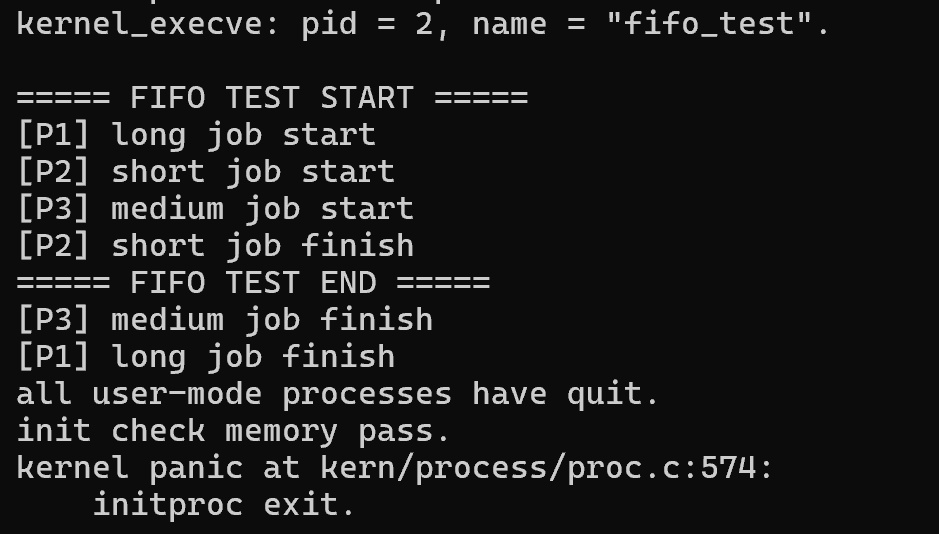
FIFO的执行顺序为P1 → P2 → P3，长作业阻塞短作业，实现简单，公平性好，但可能效率低。

SJF 输出示例
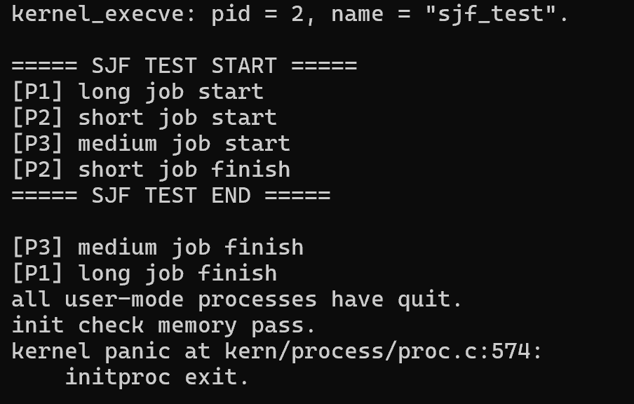
SJF的执行顺序为P2 → P3 → P1，平均等待时间最短，平均效率高，但需要估计作业长度。

结论：
FIFO 调度器严格按照进程到达顺序执行，适用于作业长度相近的场景。
SJF 调度器优先执行短作业，适用于对平均响应时间要求高的系统，但长作业可能被延迟。

五、实验结果
RR调度算法：
输入make qemu:
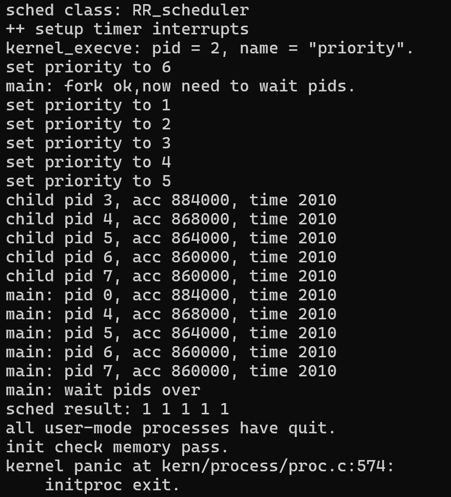
输入make grade:

stride调度算法：
输入make qemu:
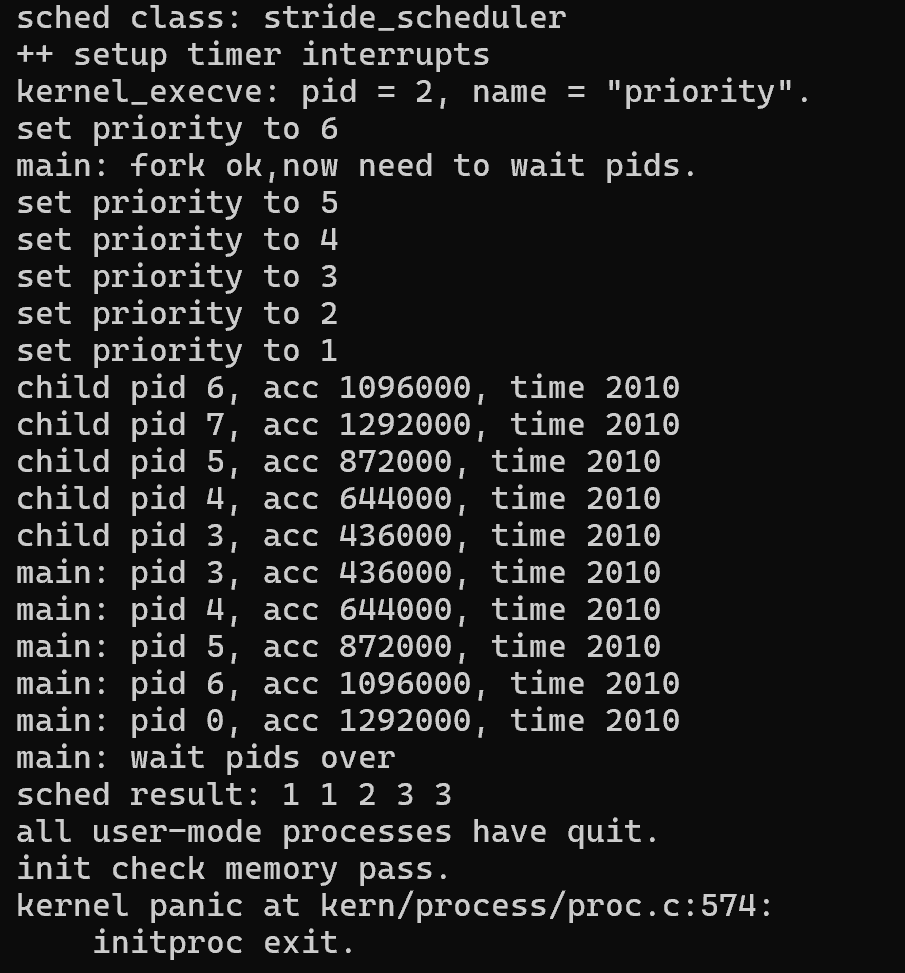
输入make grade:

FIFO调度算法：
输入make qemu:

SJF调度算法：
输入make qemu:

六、OS知识点对比
6.1 本实验覆盖的进程调度核心知识点
1.调度器抽象框架：通过`sched_class`结构体定义调度算法的统一接口（init、enqueue、dequeue、pick_next、proc_tick），实现调度算法与内核逻辑的解耦，便于切换/新增调度算法。
2.运行队列结构：lab6扩展了`run_queue`，同时支持链表（适配RR调度）和斜堆（适配Stride调度），兼容不同调度算法的存储需求。
3.进程状态与生命周期：明确进程的4种状态（PROC_UNINIT/PROC_RUNNABLE/PROC_SLEEPING/PROC_ZOMBIE）及状态流转逻辑，调度仅针对PROC_RUNNABLE状态的进程。
4.调度触发机制：区分主动调度（进程主动放弃CPU，如wait/sleep）和被动调度（进程未主动放弃，通过系统调用/时钟中断触发）。
5.时间片轮转（RR）调度：给进程分配固定时间片，时间片用尽后移至队列尾，通过链表实现公平调度，核心是时间片的更新与队列的入队/出队操作。
6.Stride调度算法：基于优先级分配时间片，通过Stride值（Stride=BigStride/优先级）和斜堆优先队列选择Stride最小的进程，实现“时间片与优先级成正比”的公平调度。
7.调度核心流程：调度器初始化（sched_init）、进程入队（wakeup_proc调用enqueue）、进程选路（schedule调用pick_next）、时钟中断更新（proc_tick更新时间片/Stride）的完整流程。
8.进程控制块的调度相关字段：进程控制块中新增time_slice（时间片）、lab6_stride（Stride值）、lab6_priority（优先级）等字段，支撑不同调度算法的运行。

6.2 本实验未涉及但重要的进程调度知识点
1.多级反馈队列调度：结合RR与优先级调度的优势，设计多优先级队列，高优先级队列时间片小、低优先级队列时间片大，进程用完时间片则降优先级，兼顾短进程响应与长进程吞吐量。
2.短作业优先（SJF）/最短剩余时间优先（SRTF）：优先调度运行时间最短的进程，能提升系统吞吐量，但可能导致长进程饥饿。
3.完全公平调度（CFS）：Linux默认调度算法，通过虚拟运行时间跟踪进程CPU占用，选择虚拟运行时间最少的进程，实现更精细的公平性。
4.实时调度算法：如速率单调调度（RMS）、最早截止时间优先（EDF），针对实时任务的截止时间需求，保证高优先级任务的及时执行。
5.抢占式与非抢占式调度：实验中RR是抢占式（时间片用尽触发调度），但未明确区分两类调度的差异及适用场景。
6.多CPU调度：实验仅支持单CPU，实际OS需处理多CPU的负载均衡、进程亲和性等问题。
7.调度性能指标：实验未涉及吞吐量、响应时间、周转时间等指标的量化分析，这些是评估调度算法优劣的核心依据。
8.调度的饥饿与死锁：实验未涉及调度算法导致的进程饥饿（如低优先级进程长期得不到调度）及避免策略。
