Lab8实验报告
小组成员：叶喆妍 吴秋媛 李昱
一、实验目的

1. 理解 uCore 文件系统（SFS）的组织结构及文件访问流程；
2. 掌握文件读操作在文件系统中的实现方法；
3. 实现基于文件系统的用户程序执行机制；
4. 理解 UNIX 中管道（Pipe）、软连接（Symbolic Link）和硬连接（Hard Link）的设计思想，并给出在 uCore 中的设计方案。

二、实验环境

操作系统：uCore
文件系统：Simple File System（SFS）
硬件架构：RISC-V
运行环境：QEMU

三、实验内容

1.练习1：读文件操作的实现

1.1 文件读操作流程概述

在 uCore 中，文件的读操作大致流程如下：

1. 根据文件描述符定位到对应的 inode；
2. 根据 offset 和 length 计算实际可读范围；
3. 将文件的逻辑块号映射为磁盘物理块号；
4. 从磁盘块中读取数据并复制到用户缓冲区。
`sfs_io_nolock()` 是 SFS 文件系统中完成实际文件数据读写的核心函数。

1.2 `sfs_io_nolock()` 的实现思路

该函数同时支持读操作和写操作，通过 `write` 参数进行区分。
（1）边界与合法性检查
检查 offset 是否为负或超过文件最大大小；
对读操作，保证不会读超过文件当前大小；
对写操作，保证不会超过文件最大容量。

（2）按块进行读操作
文件数据以固定大小的块（`SFS_BLKSIZE`）存储在磁盘中。  
实际读操作需要处理以下情况：
起始 offset 不对齐块边界；
跨越多个完整数据块；
结尾不足一个完整块。

实现中采用循环方式，逐块完成数据读取：
while (cur < endpos)
    → 计算当前逻辑块号和块内偏移
    → 通过 sfs_bmap_load_nolock 映射磁盘块号
    → 使用 sfs_rbuf 读取数据
    → 更新偏移与已完成长度

（3）关键函数说明
`sfs_bmap_load_nolock()`：将文件逻辑块号映射为磁盘块号；
`sfs_rbuf()`：从磁盘块中读取指定偏移和长度的数据；
`alenp`：用于返回实际成功读写的字节数。

1.3 正确性分析
读操作不会越界访问文件数据；
当 offset 超过文件大小时，直接返回 0；
能正确处理跨块和非对齐读操作；
实现逻辑与 UNIX 文件系统块读写机制一致。

1.4 代码实现

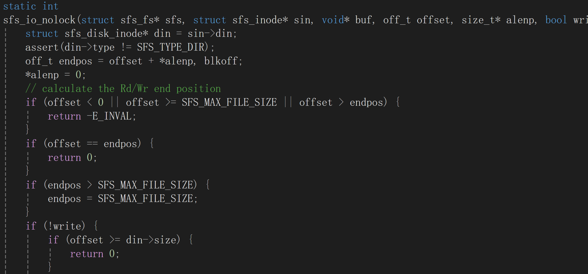
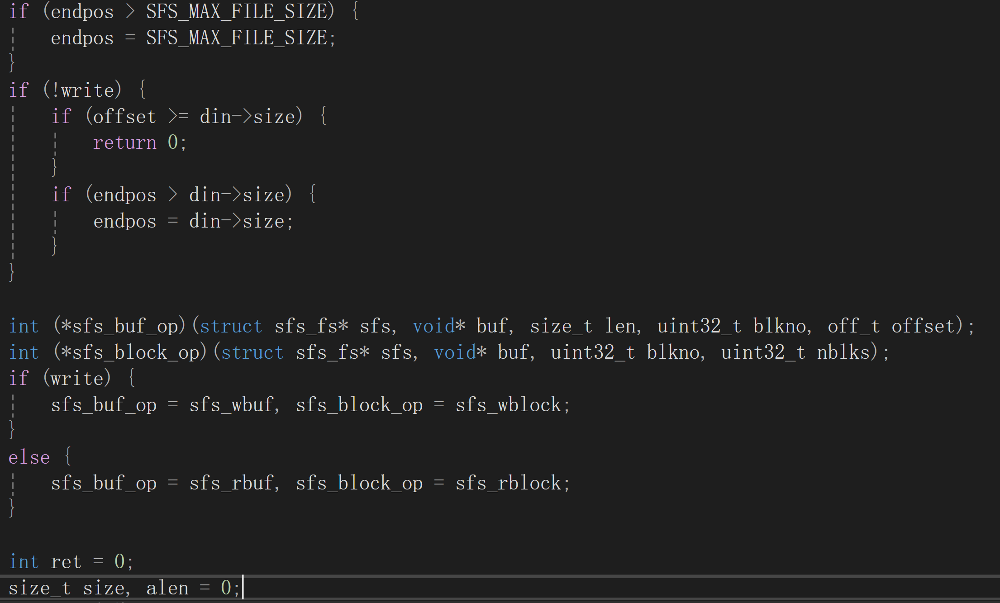
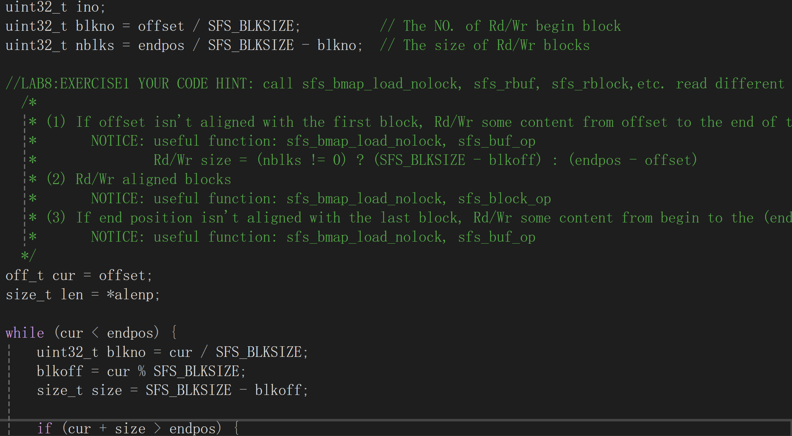
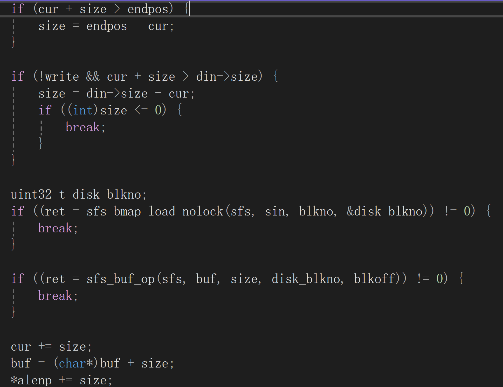
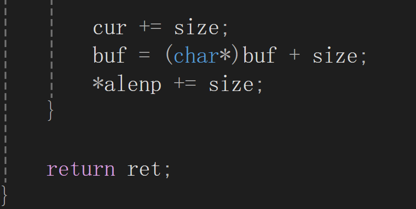

2.练习 2：基于文件系统的执行程序机制

2.1 实验目标
实现从 SFS 文件系统中直接加载 ELF 格式的用户程序，并正确执行。

2.2 执行流程概述

基于文件系统的程序执行流程如下：
exec → 打开文件 → load_icode
     → 解析 ELF 文件
     → 加载程序段
     → 构建用户栈
     → 切换到用户态执行

2.3 `load_icode()` 的实现分析

（1）创建并初始化内存管理结构

调用 `mm_create()` 创建新的地址空间；
调用 `setup_pgdir()` 初始化页目录。

（2）读取并解析 ELF 文件头

使用 `load_icode_read()` 从文件系统读取 ELF Header；
校验 ELF 魔数，保证文件合法性。

（3）加载程序段（TEXT / DATA / BSS）

对于每个 `ELF_PT_LOAD` 类型的段：

1. 使用 `mm_map()` 建立虚拟内存区域；
2. 使用 `pgdir_alloc_page()` 分配物理页面；
3. 从文件中读取 TEXT/DATA 内容；
4. 对 BSS 区域进行零初始化。

（4）构建用户栈并传递参数

映射用户栈区域；
分配栈页；
将 `argc` 和 `argv` 拷贝到用户栈；
保证栈地址对齐。

（5）切换到新进程执行环境

设置 `current->mm` 与页表基地址；
切换页表（`lsatp`）；
初始化 trapframe，准备返回用户态执行。

2.4 代码实现

load_icode函数编写如下
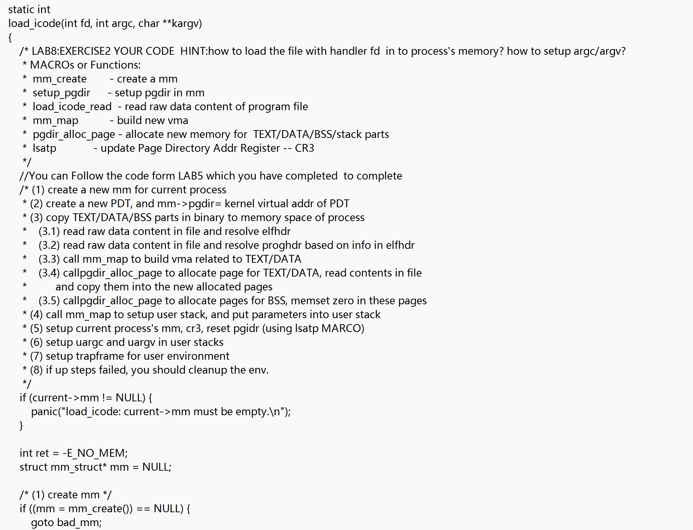
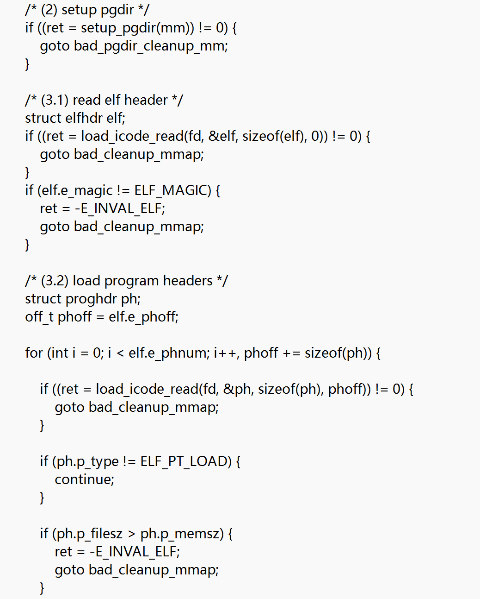
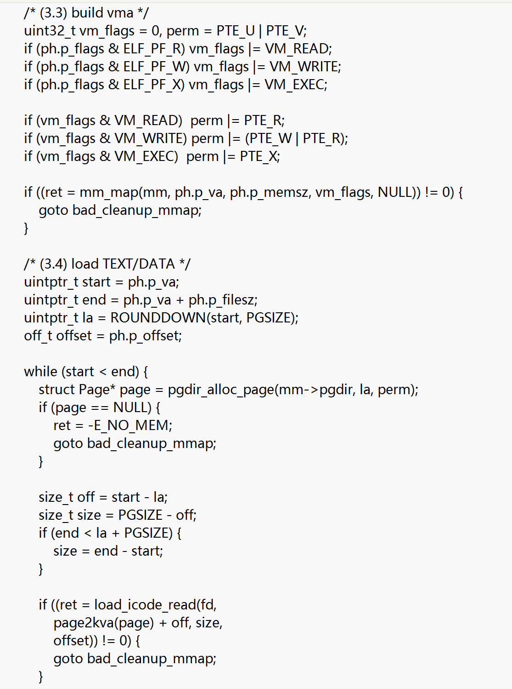
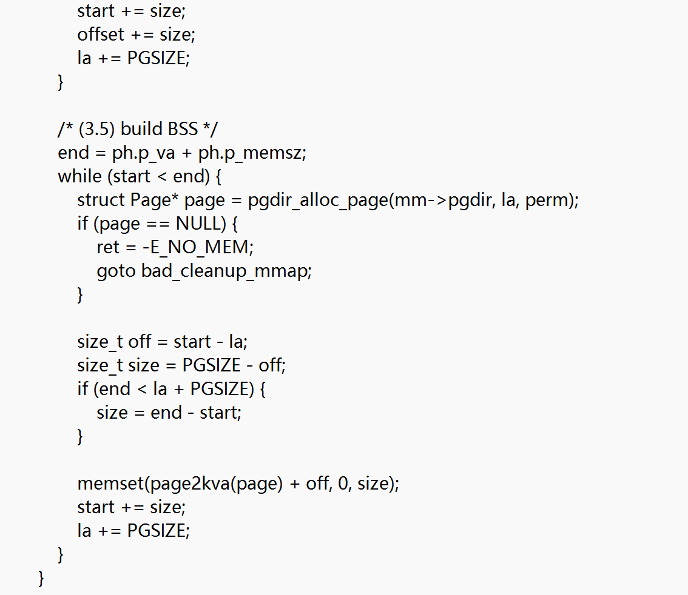
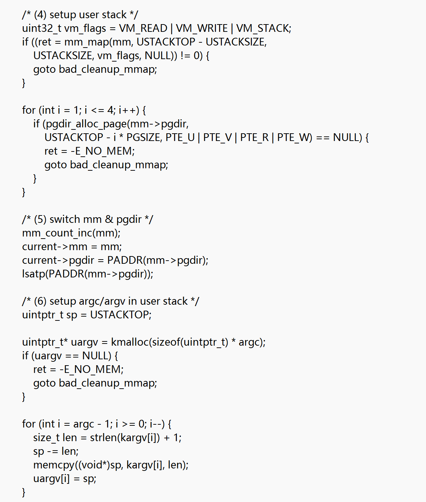
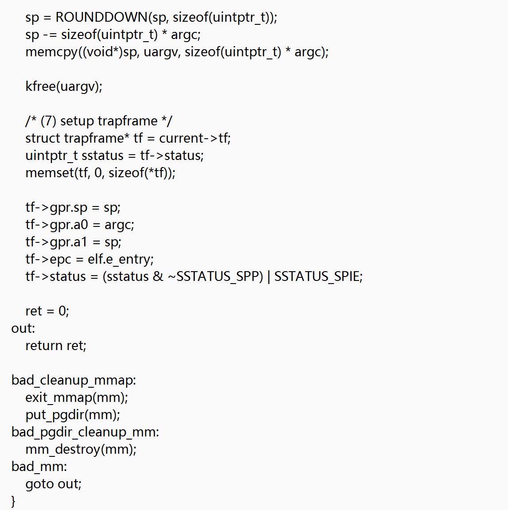
其余相关函数改写：
alloc_proc函数的改动：
分配pcb前进行文件指针初始化：
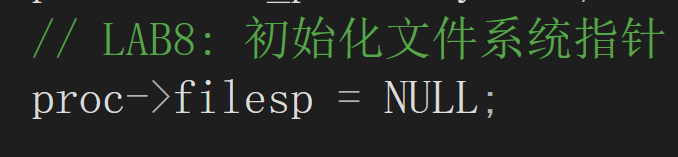
proc_run函数的改动：
调用switch_to函数前实现tlb刷新：
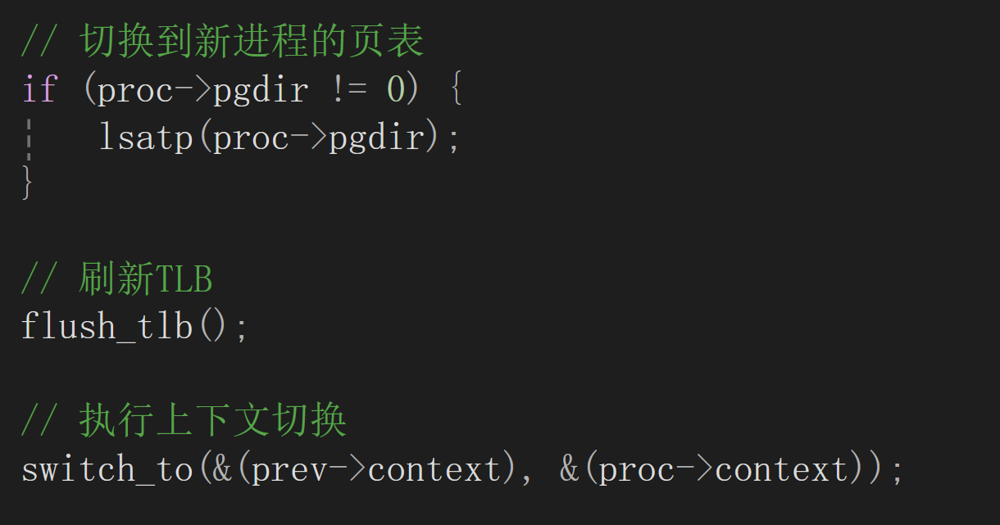
do_fork函数的改动：
实现父进程prc_struct的文件系统复制：
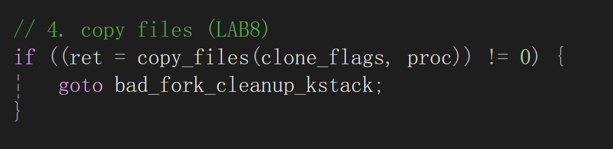

2.5 实验结果

执行 `make qemu` 可成功启动系统，正确进入 `sh` 用户程序界面：
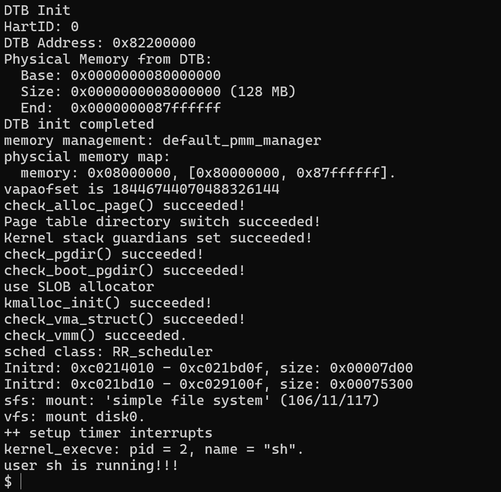
在 `sh` 中可以正常执行 `exit`、`hello` 等用户程序：
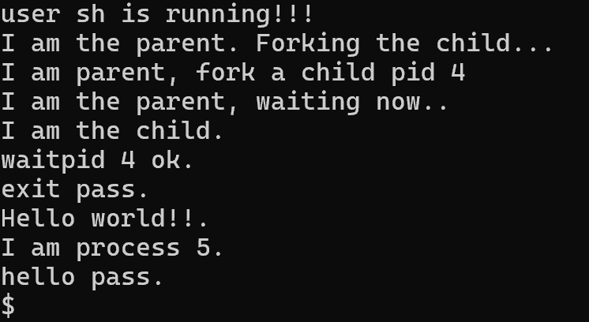

四、扩展练习
Challenge 1：UNIX Pipe 机制设计方案

1.设计目标
实现 UNIX 风格的匿名管道，用于进程间的字节流通信。

2.核心数据结构设计

struct pipe {
    char buffer[PIPE_BUF_SIZE];
    uint32_t rpos, wpos;
    int read_open, write_open;
    wait_queue_t rqueue, wqueue;
    spinlock_t lock;
};

3.系统调用接口设计

`int pipe(int fd[2]);`
`ssize_t read(int fd, void *buf, size_t len);`
`ssize_t write(int fd, const void *buf, size_t len);`
`int close(int fd);`

4.同步与互斥机制

使用自旋锁保护管道缓冲区；
缓冲区为空或满时，进程进入等待队列；
写入数据后唤醒读进程，读取数据后唤醒写进程。

Challenge 2：UNIX 软连接与硬连接机制设计方案

1.硬连接机制

多个目录项指向同一 inode；
inode 中维护 `i_nlink` 硬链接计数；
当 `i_nlink` 变为 0 时释放 inode。

2.软连接机制

软连接是特殊类型文件（`S_IFLNK`）；
inode 数据中存储目标路径字符串；
路径解析阶段自动跳转至目标路径。

3.相关系统调用

`link(oldpath, newpath)`
`symlink(target, linkpath)`
`readlink(path, buf, size)`
`unlink(path)`

4.同步与一致性保证

inode 的 `i_nlink` 修改需加锁；
目录项插入与删除需互斥保护；
防止软链接解析过程中的竞态条件。

五、OS知识点
1.本实验覆盖的操作系统核心知识点
（1）系统调用机制：是用户态与内核态交互的唯一桥梁，通过指令（RISC-V的ecall/x86的int 0x80）触发特权级切换；内核通过系统调用表按调用号匹配对应的处理函数；陷入内核时保存用户态上下文，系统调用完成后恢复；内核会校验用户传递的参数合法性，保证内核安全。
（2）文件系统分层思想：VFS作为上层抽象层，定义与文件系统无关的统一接口，向上为内核和用户提供统一操作入口，向下屏蔽不同文件系统的差异；SFS作为下层实现层，遵循VFS接口实现磁盘操作逻辑，负责管理inode、目录项和数据块。
（3）文件系统四大核心抽象及映射：进程fd表的fd是进程内的文件标识，对应file结构体；file结构体是内核级文件打开实例，记录读写偏移、打开标志并指向inode；inode是文件的本体标识，存储元信息且全局唯一；目录项是文件名与inode号的映射，一个inode可对应多个目录项，四者形成“进程fd表[fd]→file结构体→inode结构体→磁盘文件”的映射链。
（4）open系统调用：本质是完成文件路径到进程fd的映射，核心动作包括路径解析、文件存在性校验或创建、权限检查、fd分配、file与inode的绑定。
（5）read系统调用：基于fd映射链，从文件inode的磁盘数据块分块读取数据，通过copy_to_user将数据安全拷贝到用户缓冲区，核心动作包括分块读写、逻辑块到物理块的映射、内核与用户空间的数据拷贝。
（6）文件标志分工：O_CREAT用于文件不存在时创建，O_TRUNC用于文件存在且可写时清空，O_WRONLY/O_RDONLY用于控制访问权限，三者组合可实现重定向功能。
（7）fd重定向（dup2）：通过修改进程fd表的指针映射，让0/1号fd指向目标文件，步骤为打开临时fd、关闭目标fd、用dup2复制指针、关闭临时fd。
（8）文件数据块管理：采用按需分配原则，当访问的逻辑块号等于当前已分配块数时，为文件新增磁盘数据块实现动态扩容，同时标记inode为dirty，保证元信息写回磁盘。
（9）软硬链接：硬链接是为已有inode新增目录项，目标inode的链接数加1，共享inode且目标删除后仍可访问（链接数大于0），不可跨文件系统或指向目录；软链接是创建独立新文件，拥有专属inode且内容为目标路径，目标删除后变为死链接，无限制。
（10）进程管理相关支撑：每个进程拥有独立的fd表，存储fd与file的映射；通过CR3/SATP寄存器存储进程页目录表物理地址，实现地址空间隔离；内核与用户空间隔离，需通过copy_to_user/copy_from_user完成数据拷贝。
（11）存储管理：磁盘存储以块为单位，实现逻辑块号到物理块号再到扇区号的映射；内存中管理inode、目录项等，采用按需分配和脏页写回机制；文件读写时拆分为起始未对齐块、中间整块、末尾未对齐块处理，适配存储特性。
（12）同步互斥机制：通过inode锁、缓冲区锁保证同一时间仅一个进程操作临界资源；管道用读信号量控制数据可读、写信号量控制空间可写，实现读写同步，临界区操作必须加锁。
（13）块设备驱动基础：以块为单位读写，驱动完成SFS逻辑块号到磁盘物理扇区号的映射，调用硬件控制器完成实际的磁盘操作。

2.本实验未涉及但重要的操作系统知识点
（1）日志文件系统：解决文件系统的数据一致性问题，通过“先写日志、再写数据”的方式，避免断电导致的文件系统损坏，是Linux等系统的默认文件系统类型。
（2）文件缓存机制：在内存中开辟页缓存，将磁盘文件数据缓存到内存，读写优先访问内存以提升效率，包含缓存淘汰（如LRU算法）和脏页回写特性。
（3）特殊虚拟文件系统：如procfs（存储进程与内核状态）、sysfs（存储设备信息）、tmpfs（内存临时文件），无实际磁盘存储，用于内核与用户态的信息交互。
（4）文件系统挂载机制：支持多文件系统挂载，通过mount系统调用将不同分区或设备的文件系统挂载到指定目录，形成统一的目录树。
（5）进程间通信进阶：共享内存是效率最高的IPC方式，多进程共享物理内存无需数据拷贝；消息队列基于内核缓冲区实现带优先级的消息通信；Socket支持跨主机进程通信，也可用于本机通信。
（6）线程模型：线程是调度的基本单位，进程是资源分配的基本单位，线程共享进程资源且切换开销小，分为用户级、内核级、混合线程。
（7）进程状态与生命周期：包含新建、就绪、运行、阻塞、终止五种状态，孤儿进程会被init进程收养，僵尸进程需父进程回收以释放资源。
（8）进程调度算法：基础算法包括先来先服务、短作业优先、时间片轮转、优先级调度；高级算法包括多级反馈队列、完全公平调度（Linux默认），目标是保证公平性与执行效率。
（9）内存管理进阶：采用伙伴系统分配连续页框、slab分配器分配小内存块；交换分区在内存不足时将不常用页换出到磁盘；内存映射将文件映射到进程地址空间实现直接访问；缺页异常触发内核完成页分配与映射。
（10）字符设备驱动：以字节为单位读写，如键盘、串口等，Linux中设备以文件形式存在于/dev目录，通过主/次设备号区分，实现设备无关性。
（11）DMA技术：硬件直接访问内存无需CPU参与，大幅提升磁盘、网卡等设备的读写效率。
（12）中断与异常处理：分为外部中断、内部中断、软中断，处理流程为保存上下文、执行中断服务程序、恢复上下文，是系统调用、设备驱动、进程调度的基础。
（13）系统启动流程：依次经过BIOS/UEFI、引导程序、内核加载、根文件系统挂载、init进程启动，是操作系统启动的基础流程。
