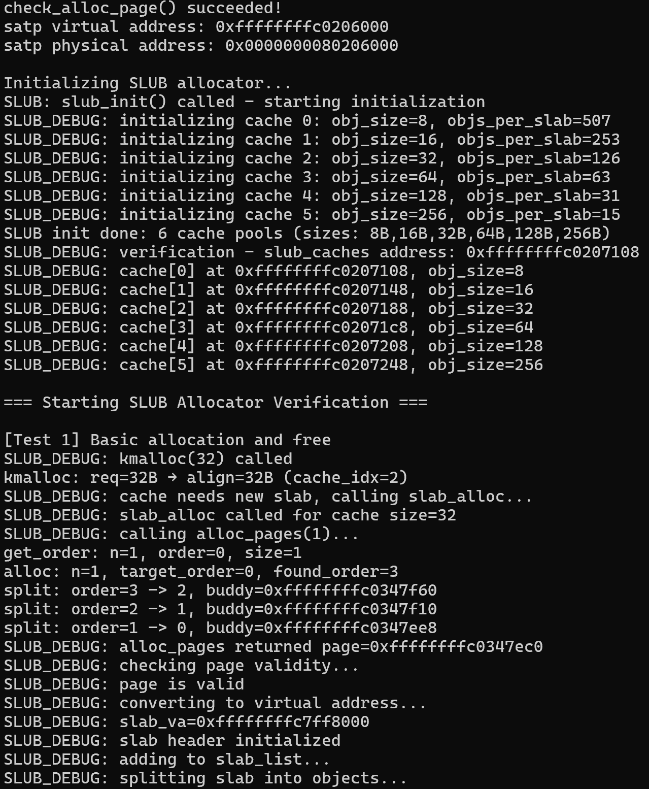
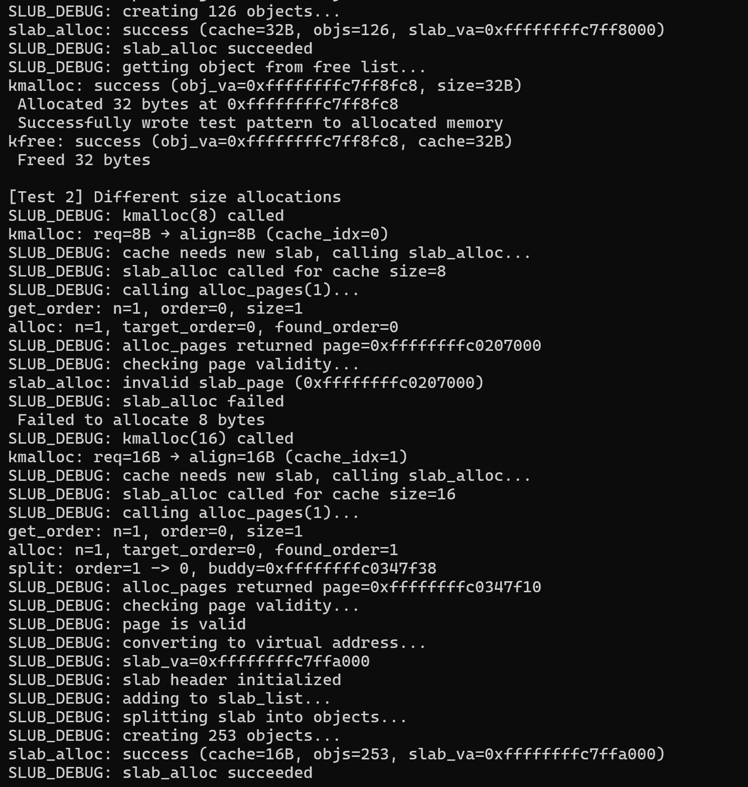
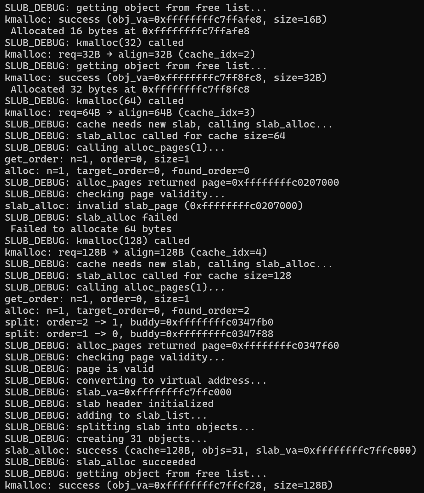
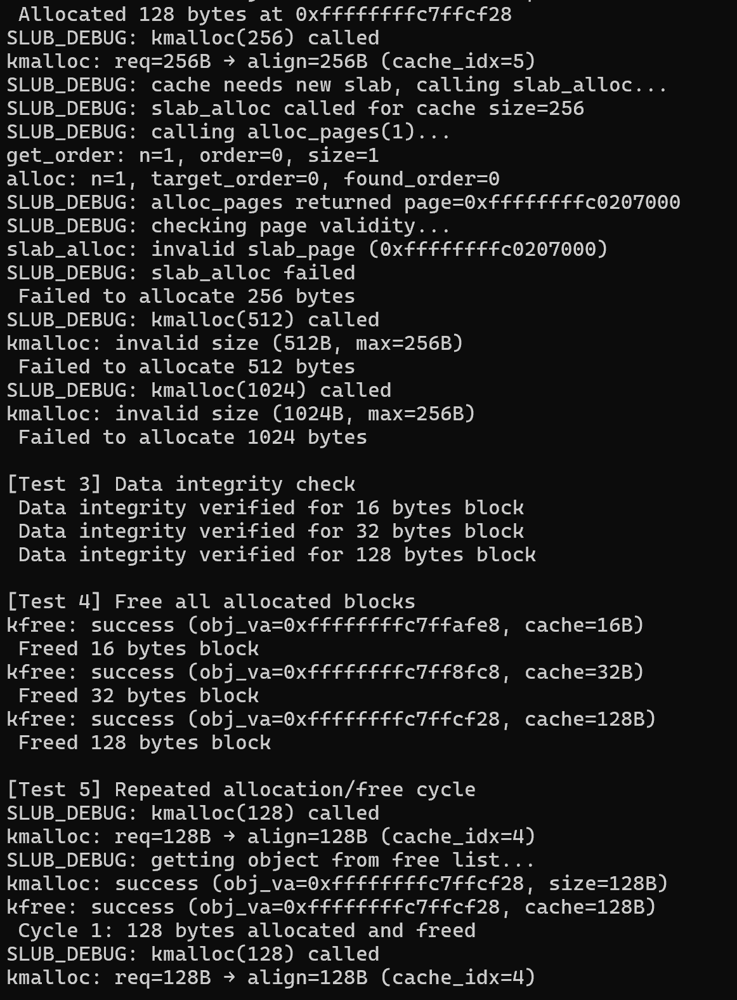
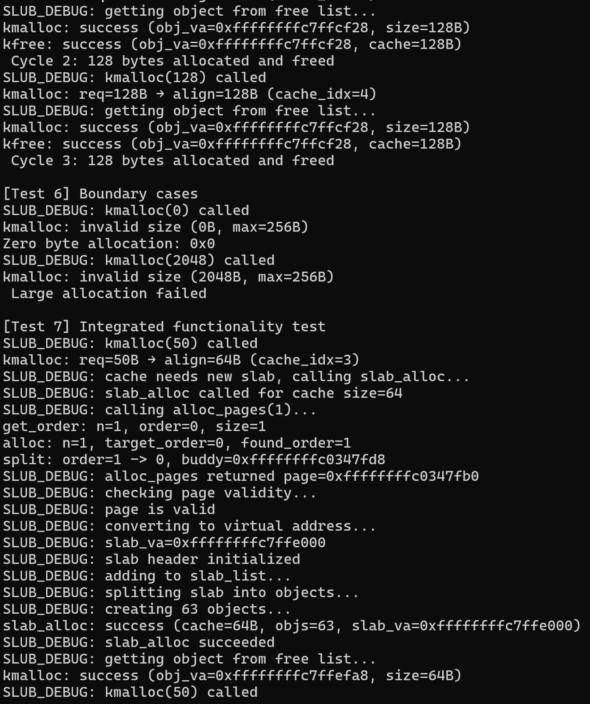
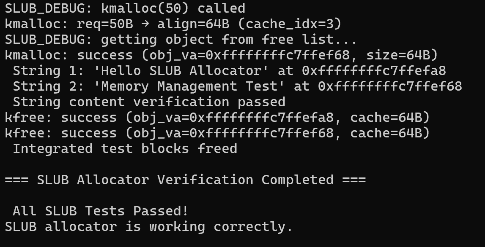

ucore SLUB 内存分配算法设计文档
1. 核心设计思想
SLUB 的核心逻辑围绕 “两层分配架构 + 固定大小对象缓存” 展开：
两层分配拆分：第一层依赖伙伴系统分配 1 页大小的 “Slab 块”，作为小对象存储容器；第二层在 Slab 块内拆分固定大小对象，用链表管理空闲对象，避免频繁操作伙伴系统；
固定大小对象缓存：为预设的 6 种对象大小（8B、16B、32B、64B、128B、256B）分别创建缓存池，用户请求自动向上对齐到最近预设大小，从对应缓存池分配；
轻量化元数据：Slab 块元数据（归属缓存池、空闲对象数等）嵌入块头部，不单独占用额外内存；
简化回收：释放对象仅放回缓存池空闲链表，不将 Slab 块归还伙伴系统，减少性能损耗。
2. 核心数据结构
预设对象大小数组：
#define SLUB_OBJ_SIZES {8,16,32,64,128,256}
#define SLUB_OBJ_CNT 6
static const size_t g_obj_sizes[SLUB_OBJ_CNT] = SLUB_OBJ_SIZES;
存储 SLUB 支持的 6 种固定对象大小，用于请求大小对齐与缓存池匹配。

对象缓存池数组：
typedef struct kmem_cache {
    size_t obj_size;            // 缓存池管理的对象大小
    size_t obj_align;           // 对象对齐方式（与obj_size一致）
    size_t objs_per_slab;       // 每个Slab块可容纳的对象数
    list_entry_t free_obj_list; // 空闲对象链表
    list_entry_t slab_list;     // Slab块链表
    int state;                  // 缓存池状态（CACHE_NEED_SLAB/CACHE_AVAILABLE）
} kmem_cache_t;
kmem_cache_t slub_caches[SLUB_OBJ_CNT];
数组下标对应预设对象大小，每个元素管理对应大小对象的 Slab 块与空闲对象。

Slab 块头部元数据：
typedef struct slab_header {
    kmem_cache_t *cache;        // 所属缓存池指针
    size_t slab_size;           // Slab块大小（固定4096B）
    size_t free_obj_cnt;        // 块内空闲对象数
    list_entry_t slab_link;     // 接入缓存池Slab链表的节点
} slab_header_t;
嵌入 Slab 块起始位置，记录块的核心状态，元数据大小为SLAB_HEADER_SIZE = sizeof(slab_header_t)。

全局常量定义：
#define PAGE_SIZE 4096          // Slab块大小（1页）
#define SLAB_HEADER_SIZE sizeof(slab_header_t) // Slab元数据大小
定义 SLUB 算法依赖的基础大小常量。
3. 关键函数逻辑
（1）初始化：slub_init
功能：初始化 6 个对象缓存池，设置每个缓存池的对象大小、对齐方式、对象数，初始化链表与状态。
代码逻辑：
void slub_init(void) {
    for (int i = 0; i < SLUB_OBJ_CNT; i++) {
        kmem_cache_t *cache = &slub_caches[i];
        cache->obj_size = g_obj_sizes[i];
        cache->obj_align = g_obj_sizes[i];
        // 计算每个Slab块可容纳的对象数：(页大小-元数据大小)/对象大小
        cache->objs_per_slab = (PAGE_SIZE - SLAB_HEADER_SIZE) / cache->obj_size;
        list_init(&cache->free_obj_list); // 初始化空闲对象链表
        list_init(&cache->slab_list);     // 初始化Slab块链表
        cache->state = CACHE_NEED_SLAB;   // 初始无Slab块，需后续分配
    }
}

（2）Slab 块分配：slab_alloc
功能：为指定缓存池从伙伴系统分配 1 页 Slab 块，拆分固定大小对象并构建空闲链表。
核心步骤：
调用伙伴系统alloc_pages(1)分配 1 页物理内存，转换为虚拟地址；
初始化 Slab 块头部元数据（归属缓存池、空闲对象数等）；
将 Slab 块接入缓存池的slab_list链表；
拆分 Slab 块剩余空间为固定大小对象，用链表链接并加入缓存池free_obj_list；
更新缓存池状态为CACHE_AVAILABLE。
代码核心片段：
static int slab_alloc(kmem_cache_t *cache) {
    // 1. 从伙伴系统分配1页
    struct Page *slab_page = alloc_pages(1);
    if (slab_page == NULL) return -1;
    // 2. 转换地址并初始化Slab头部
    void *slab_va = page2va(slab_page);
    slab_header_t *slab_hdr = (slab_header_t *)slab_va;
    slab_hdr->cache = cache;
    slab_hdr->slab_size = PAGE_SIZE;
    slab_hdr->free_obj_cnt = cache->objs_per_slab;
    // 3. 接入Slab链表
    list_add(&cache->slab_list, &slab_hdr->slab_link);
    // 4. 拆分对象并构建空闲链表
    char *obj_va = (char *)slab_va + SLAB_HEADER_SIZE;
    list_entry_t *free_list = &cache->free_obj_list;
    for (size_t i = 0; i < cache->objs_per_slab; i++) {
        list_entry_t *obj_node = (list_entry_t *)obj_va;
        list_add(free_list, obj_node);
        obj_va += cache->obj_size;
    }
    // 5. 更新缓存池状态
    cache->state = CACHE_AVAILABLE;
    return 0;
}

（3）对象分配：kmalloc
功能：接收任意大小内存请求，从对应缓存池分配空闲对象，返回虚拟地址。
核心步骤：
检查请求大小（排除 0 或超过 256B 的请求）；
调用slub_get_cache_idx找到请求大小对应的缓存池索引；
若缓存池无空闲对象，调用slab_alloc分配新 Slab 块；
从缓存池free_obj_list取下一个空闲对象，删除链表节点；
更新对应 Slab 块的空闲对象计数，返回对象地址。
代码核心片段：
void *kmalloc(size_t size) {
    // 1. 参数检查
    if (size == 0 || size > g_obj_sizes[SLUB_OBJ_CNT - 1]) return NULL;
    // 2. 匹配缓存池
    int cache_idx = slub_get_cache_idx(size);
    if (cache_idx == -1) return NULL;
    kmem_cache_t *cache = &slub_caches[cache_idx];
    // 3. 补充Slab块（无空闲对象时）
    if (cache->state == CACHE_NEED_SLAB || list_empty(&cache->free_obj_list)) {
        if (slab_alloc(cache) != 0) return NULL;
    }
    // 4. 分配对象
    list_entry_t *free_obj_node = list_next(&cache->free_obj_list);
    list_del(free_obj_node);
    // 5. 更新Slab空闲计数
    slab_header_t *slab_hdr = list_entry(cache->slab_list.next, slab_header_t, slab_link);
    slab_hdr->free_obj_cnt--;
    return (void *)free_obj_node;
}

（4）对象释放：kfree
功能：将对象放回对应缓存池空闲链表，更新 Slab 块空闲计数。
核心步骤：
检查对象地址（排除 NULL）；
将对象地址向下对齐到PAGE_SIZE，定位所属 Slab 块头部；
验证 Slab 块归属的缓存池有效性与对象地址合法性；
将对象作为链表节点，加入缓存池free_obj_list；
更新 Slab 块的空闲对象计数。
代码核心片段：
void kfree(void *obj_va) {
    // 1. 参数检查
    if (obj_va == NULL) return;
    // 2. 定位Slab块
    uintptr_t slab_va = (uintptr_t)obj_va & ~(PAGE_SIZE - 1);
    slab_header_t *slab_hdr = (slab_header_t *)slab_va;
    // 3. 合法性验证
    kmem_cache_t *cache = slab_hdr->cache;
    uintptr_t obj_min_va = slab_va + SLAB_HEADER_SIZE;
    uintptr_t obj_max_va = slab_va + PAGE_SIZE;
    if (cache < slub_caches || cache >= slub_caches + SLUB_OBJ_CNT) return;
    if ((uintptr_t)obj_va < obj_min_va || (uintptr_t)obj_va >= obj_max_va) return;
    // 4. 放回空闲链表
    list_entry_t *obj_node = (list_entry_t *)obj_va;
    list_add(&cache->free_obj_list, obj_node);
    // 5. 更新Slab空闲计数
    slab_hdr->free_obj_cnt++;
}

（5）工具函数：slub_get_cache_idx和page2va
功能：将用户请求大小向上对齐到最近预设对象大小，返回对应缓存池索引。
代码逻辑：
static int slub_get_cache_idx(size_t req_size) {
    // 遍历预设大小，找到第一个>=请求大小的缓存池
    for (int i = 0; i < SLUB_OBJ_CNT; i++) {
        if (g_obj_sizes[i] >= req_size) {
            return i;
        }
    }
    return -1; // 超过最大对象大小，分配失败
}
功能：物理页转虚拟地址
代码逻辑：
static void* page2va(struct Page* page) {
    return (void*)(page2pa(page) + PHYSICAL_MEMORY_OFFSET);
}

（6）测试验证：slub_check（含基础 / 边界 / 一致性测试）
测试样例：
void slub_alloc_free_verification(void) {
    cprintf("\n=== Starting SLUB Allocator Verification ===\n");
    // 测试1: 基本分配释放
    cprintf("\n[Test 1] Basic allocation and free\n");
    void* ptr1 = kmalloc(32);
    if (ptr1 != NULL) {
        cprintf(" Allocated 32 bytes at %p\n", ptr1);
        // 写入测试数据
        memset(ptr1, 0xAA, 32);
        cprintf(" Successfully wrote test pattern to allocated memory\n");
        kfree(ptr1);
        cprintf(" Freed 32 bytes\n");
    }
    else {
        cprintf(" Failed to allocate 32 bytes\n");
    }
    // 测试2: 不同大小的分配
    cprintf("\n[Test 2] Different size allocations\n");
    size_t sizes[] = { 8, 16, 32, 64, 128, 256, 512, 1024 };
    void* pointers[8];
    for (int i = 0; i < 8; i++) {
        pointers[i] = kmalloc(sizes[i]);
        if (pointers[i] != NULL) {
            cprintf(" Allocated %d bytes at %p\n", sizes[i], pointers[i]);
            // 写入唯一模式以便验证
            memset(pointers[i], 0xA0 + i, sizes[i]);
        }
        else {
            cprintf(" Failed to allocate %d bytes\n", sizes[i]);
        }
    }
    // 验证数据完整性
    cprintf("\n[Test 3] Data integrity check\n");
    for (int i = 0; i < 8; i++) {
        if (pointers[i] != NULL) {
            // 检查第一个字节是否正确
            if (*((char*)pointers[i]) == (char)(0xA0 + i)) {
                cprintf(" Data integrity verified for %d bytes block\n", sizes[i]);
            }
            else {
                cprintf(" Data corruption detected for %d bytes block\n", sizes[i]);
            }
        }
    }
    // 测试4: 释放所有分配的内存
    cprintf("\n[Test 4] Free all allocated blocks\n");
    for (int i = 0; i < 8; i++) {
        if (pointers[i] != NULL) {
            kfree(pointers[i]);
            cprintf(" Freed %d bytes block\n", sizes[i]);
        }
    }
    // 测试5: 重复分配释放测试（检测内存泄漏）
    cprintf("\n[Test 5] Repeated allocation/free cycle\n");
    for (int cycle = 0; cycle < 3; cycle++) {
        void* temp_ptr = kmalloc(128);
        if (temp_ptr != NULL) {
            memset(temp_ptr, 0xCC, 128);
            kfree(temp_ptr);
            cprintf(" Cycle %d: 128 bytes allocated and freed\n", cycle + 1);
        }
    }
    // 测试6: 边界情况测试
    cprintf("\n[Test 6] Boundary cases\n");
    // 测试0字节分配（应该返回NULL或有效指针，取决于实现）
    void* zero_alloc = kmalloc(0);
    cprintf("Zero byte allocation: %p\n", zero_alloc);
    if (zero_alloc != NULL) {
        kfree(zero_alloc);
    }
    // 测试大分配
    void* large_alloc = kmalloc(2048);
    if (large_alloc != NULL) {
        cprintf(" Large allocation (2048 bytes) successful at %p\n", large_alloc);
        kfree(large_alloc);
        cprintf(" Large allocation freed\n");
    }
    else {
        cprintf(" Large allocation failed\n");
    }
    // 测试7: 集成功能测试
    cprintf("\n[Test 7] Integrated functionality test\n");
    char* str1 = (char*)kmalloc(50);
    char* str2 = (char*)kmalloc(50);
    if (str1 && str2) {
        strcpy(str1, "Hello SLUB Allocator");
        strcpy(str2, "Memory Management Test");
        cprintf(" String 1: '%s' at %p\n", str1, str1);
        cprintf(" String 2: '%s' at %p\n", str2, str2);
        // 验证字符串内容
        assert(strcmp(str1, "Hello SLUB Allocator") == 0);
        assert(strcmp(str2, "Memory Management Test") == 0);
        cprintf(" String content verification passed\n");
        kfree(str1);
        kfree(str2);
        cprintf(" Integrated test blocks freed\n");
    }
    cprintf("\n=== SLUB Allocator Verification Completed ===\n");
}
调试结果：

